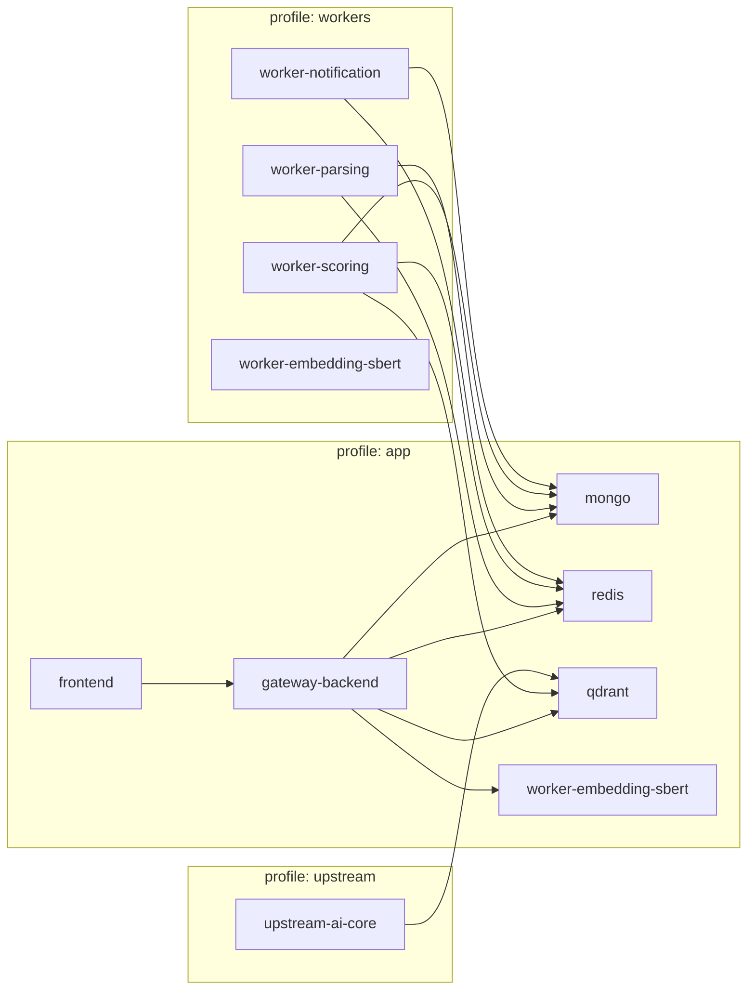

# CV-Matching Monorepo


Monorepo quản lý quy trình phân tích và khớp CV (CV matching), bao gồm Gateway API backend, ứng dụng frontend, các worker xử lý tác vụ nền và cơ sở hạ tầng đi kèm.

## Đường dẫn nhanh

- Workflow tích hợp Backend: `.github/workflows/backend-integration.yml`
- Workflow kiểm soát chất lượng Frontend: `.github/workflows/frontend-quality.yml`
- Workflow Docker Smoke: `.github/workflows/docker-smoke.yml`
- Workflow Docker Prod Smoke: `.github/workflows/docker-prod-smoke.yml`
- Cấu hình Production Compose Override: `docker-compose.prod.yml`
- Nhật ký công việc hoàn thành: `task-completed.md`
- Thư mục Backend: `apps/backend`
- Thư mục Frontend: `apps/frontend`

---

## Hướng dẫn Khởi động Nhanh (Quy trình Phát triển Hàng ngày)

### Phía Backend

1. Khởi động các dịch vụ hạ tầng phụ thuộc:

```powershell
docker compose --profile app up -d mongo redis qdrant worker-embedding-sbert
```

2. Chạy ứng dụng Backend ở chế độ Watch (tự động cập nhật khi sửa code):

```powershell
cd apps/backend
npm install
npm run dev
```

3. Kiểm tra trạng thái hoạt động của Backend:

```powershell
node -e "fetch('http://127.0.0.1:3001/api/health').then((r)=>console.log(r.status)).catch((e)=>{console.error(e);process.exit(1);})"
```

### Phía Frontend

1. Đảm bảo Backend đang chạy ổn định trên cổng `3001`.
2. Khởi chạy Frontend ở chế độ phát triển:

```powershell
cd apps/frontend
npm install
npm run dev -- --hostname 0.0.0.0 --port 3000
```

3. Truy cập ứng dụng qua trình duyệt:
- http://localhost:3000

### Khởi động Full Stack (Bằng Một Câu Lệnh Duy Nhất)

```powershell
docker compose --profile app up -d --build
```

---

### Các Script PowerShell Tiện ích Hàng ngày

```powershell
./scripts/dev-up.ps1
./scripts/dev-smoke.ps1
./scripts/dev-logs.ps1 -Follow
./scripts/dev-down.ps1
./scripts/queue-inspect.ps1 -ShowSamples
./scripts/queue-replay-dlq.ps1 -Count 5 -DryRun
./scripts/queue-replay-dlq.ps1 -Count 5 -DryRun -AuditFile ./scripts/replay-audit.local.jsonl
./scripts/replay-audit-retention.ps1 -AuditFile ./scripts/replay-audit.local.jsonl -MaxLines 5000 -CompressArchive
./scripts/verify-e2e-product.ps1
./scripts/release-readiness-product-e2e.ps1
```

Các tham số điều chỉnh hàng đợi (Queue worker tuning knobs):
- `SCORING_QUEUE_MAX_RETRIES` (mặc định: `3`)
- `SCORING_RETRY_BACKOFF_MODE` (`linear` hoặc `exponential`, mặc định: `linear`)
- `SCORING_RETRY_BACKOFF_MS` (độ trễ cơ bản ms, mặc định: `1000`)
- `SCORING_RETRY_BACKOFF_MAX_MS` (độ trễ giới hạn tối đa ms, mặc định: `10000`)
- `SCORING_DLQ_NAME` (mặc định: `application_scoring_queue_dlq`)
- `SCORING_METRICS_LOG_INTERVAL_MS` (tần suất worker ghi log nhịp tim/heartbeat, mặc định: `30000`)

---

## Sơ đồ Bản đồ các Dịch vụ (Service Profiles Map)



---

## Chạy Cục bộ & Tích hợp Backend (Backend Integration)

Yêu cầu hệ thống:
- Node.js từ phiên bản 20 trở lên
- npm từ phiên bản 10 trở lên
- Docker Desktop cùng cấu hình Docker Compose

Sử dụng PowerShell tại thư mục gốc của repo:

```powershell
./scripts/run-backend-integration.ps1 2>&1 | Out-File -FilePath ./scripts/last-backend-integration.txt -Encoding utf8
```

Bạn có thể ghi đè tên database test (mặc định: `it`) để đảm bảo tên database MongoDB ngắn gọn, tránh lỗi phát sinh do tên database dài:

```powershell
./scripts/run-backend-integration.ps1 -TestDbName it 2>&1 | Out-File -FilePath ./scripts/last-backend-integration.txt -Encoding utf8
```

Các bước tự động của script wrapper này:
- Tự động kiểm tra cổng và kết nối MongoDB khả dụng để xuất các biến `MONGO_URI` + `MONGO_URI_TEST`.
- Ưu tiên MongoDB chạy trong Docker qua cổng localhost, chuẩn hóa tên DB test thành `it` để tránh lỗi DB-name quá dài trên MongoDB.
- Tự động khởi tạo các container nền cần thiết (`redis`, `qdrant`, `worker-embedding-sbert`) bằng Docker Compose.
- Bootstrap (khởi tạo cấu hình cấu trúc collection) cho Qdrant.
- Chạy các bộ test tích hợp backend trong `apps/backend`.

Kiểm thử xác thực và phân tích file CSV của backend:

```powershell
Set-Location apps/backend
npm run test:utils:csv
npm run test:integration:csv
```

Chạy toàn bộ luồng kiểm thử (CSV parser -> CSV integration -> Product flow):

```powershell
Set-Location apps/backend
npm run test:utils:csv
npm run test:integration:csv
Set-Location ..\..
./scripts/verify-e2e-product.ps1
```

---

## Hướng dẫn Chi tiết Chạy Dự án Bằng Docker (Run With Docker)

Dự án được cấu trúc hóa toàn diện để chạy trong môi trường container hóa. File cấu hình Docker Compose chính là [docker-compose.yml](docker-compose.yml).

### 1. Cấu trúc Phân nhóm Dịch vụ (Profiles)
Dự án sử dụng cơ chế `--profile` của Docker Compose để quản lý nhóm dịch vụ cần khởi chạy:
* `--profile app`: Khởi động toàn bộ ứng dụng phục vụ người dùng, bao gồm:
  - `gateway-backend` (cổng API)
  - `frontend` (giao diện web)
  - Các cơ sở dữ liệu và hạ tầng nền (`mongo`, `redis`, `qdrant`, `worker-embedding-sbert`).
* `--profile workers`: Khởi động các worker nền chuyên biệt chịu trách nhiệm phân tích xử lý dữ liệu nặng:
  - `worker-parsing` (xử lý trích xuất văn bản từ CV tải lên)
  - `worker-scoring` (tính toán điểm khớp dựa trên kỹ năng và yêu cầu công việc)
  - `worker-notification` (gửi thông báo hệ thống và email)
* `--profile upstream`: Khởi động dịch vụ lõi phụ trợ ngược dòng `upstream-ai-core`.

---

### 2. Các Bước Cài đặt và Chạy Hệ Thống

#### Bước 1: Thiết lập cấu hình biến môi trường
Trước khi khởi động, hãy tạo file `.env` tại thư mục gốc từ file mẫu `.env.example`:
```powershell
cp .env.example .env
```
Thiết lập các khóa bảo mật, cài đặt LLM hoặc cấu hình các cổng cần thiết trong file `.env` này.

#### Bước 2: Khởi động chế độ Development (Toàn bộ ứng dụng + hạ tầng)
Dùng lệnh sau để tự động đóng gói (build) image và kích hoạt các dịch vụ cơ bản chạy ngầm:
```powershell
docker compose --profile app up -d --build
```
Hệ thống sẽ tải các thư viện, biên dịch mã nguồn và chạy backend trên cổng `3001`, frontend trên cổng `3000`.

#### Bước 3: Xác nhận trạng thái của các Container
Kiểm tra xem các container đã khởi động thành công và ở trạng thái `running` (hoặc `healthy`) chưa:
```powershell
docker compose --profile app ps
```

#### Bước 4: Truy cập ứng dụng
* Giao diện người dùng (Frontend): [http://localhost:3000](http://localhost:3000)
* Trạng thái Backend (Healthcheck): [http://localhost:3001/api/health](http://localhost:3001/api/health)

#### Bước 5: Xem log giám sát thời gian thực
Để theo dõi log hoạt động của các dịch vụ nhằm phát hiện lỗi:
```powershell
docker compose --profile app logs -f gateway-backend frontend
```

#### Bước 6: Khởi động thêm các Worker xử lý nền (Nâng cao)
Khi thực hiện tải CV lên và thực hiện so khớp, bạn cần kích hoạt thêm các worker nền:
```powershell
docker compose --profile app --profile workers up -d
```

#### Bước 7: Dừng hệ thống và giải phóng tài nguyên
```powershell
docker compose --profile app --profile workers down
```

---

### 3. Triển khai trong Môi trường Sản xuất (Production Profile)

Trong môi trường thực tế (production), ta sử dụng thêm file cấu hình override [docker-compose.prod.yml](docker-compose.prod.yml) đè lên cấu hình gốc để tối ưu hiệu năng:
- **Backend Image (`apps/backend/Dockerfile.prod`)**: Cài đặt dạng rút gọn (`npm ci --omit=dev`) và chạy lệnh `npm run start`.
- **Frontend Image (`apps/frontend/Dockerfile.prod`)**: Xây dựng dưới dạng multi-stage build để tạo file Next.js standalone cực nhẹ, chạy trực tiếp qua `node server.js`.

Khởi động hệ thống Production:

```powershell
docker compose -f docker-compose.yml -f docker-compose.prod.yml --profile app up -d --build
```

Dừng hệ thống Production:

```powershell
docker compose -f docker-compose.yml -f docker-compose.prod.yml --profile app down
```

Các câu lệnh tắt nhanh bằng script PowerShell:

```powershell
./scripts/dev-up.ps1 -Prod
./scripts/dev-smoke.ps1 -Prod
./scripts/dev-logs.ps1 -Prod -Follow
./scripts/dev-down.ps1 -Prod
```

Cổng kiểm tra CI Production:
- Tự động chạy thông qua cấu hình `.github/workflows/docker-prod-smoke.yml`.

---

### 4. Chính sách Bảo mật Dữ liệu & AI (Privacy & AI Provider Policy)
- Nhà tuyển dụng (Recruiter) hoặc Quản trị viên (Admin) có thể tùy biến cài đặt `privacy_mode` trong cấu hình hệ thống:
  - `hybrid` (Lai): Cho phép sử dụng cả LLM đám mây (OpenAI, Gemini...) lẫn Ollama cục bộ.
  - `local_only` (Chỉ cục bộ): Giới hạn hệ thống chỉ được dùng Ollama để xử lý, đảm bảo dữ liệu không gửi ra internet.
  - `cloud_only` (Chỉ đám mây): Khóa Ollama và bắt buộc dùng các API đám mây.
- Các API sinh nội dung (tối ưu hóa CV, thư xin việc, email tiếp cận) sẽ kiểm tra chặt chẽ cấu hình này trước khi gọi LLM.
- API `/api/status` hiển thị công khai nhà cung cấp LLM hiện tại (`llm_provider`) và chế độ bảo mật (`privacy_mode`) để hỗ trợ giám sát.

---

## Khắc phục Sự cố trên CI (CI Troubleshooting)

Nếu bộ kiểm thử tích hợp trên GitHub Actions gặp lỗi (tại workflow `.github/workflows/backend-integration.yml`):

1. Tải về file artifact `backend-integration-log` từ trang kết quả run CI bị lỗi.
2. Nếu lỗi xảy ra ở bước test định dạng CSV, hãy tải file `backend-csv-integration-log` để kiểm tra chi tiết lỗi CSV.
3. Đọc kỹ phần tóm tắt lỗi `CSV-focused backend integration` trong run log để xem số lượng kiểm thử `pass/fail`, cảnh báo khi có `fail > 0` và lệnh tái lập lỗi cục bộ.
4. Nếu lỗi phát sinh ở matrix test `isolated-critical`, hãy tải tệp log `isolated-integration-log-<test_file>` tương ứng với file test bị lỗi.
5. So sánh với tệp log kiểm thử cục bộ gần nhất tại `scripts/last-backend-integration.txt`.
6. Sao chép và chạy lại đúng lệnh kiểm thử đó trong thư mục `apps/backend/tests/integration` trên máy cá nhân để debug.

---

## Checklist Khắc phục Sự cố Docker (Docker Troubleshooting Checklist)

### 1) Xung đột Cổng kết nối (Port Conflict)
- **Triệu chứng**: Container báo lỗi `port is already allocated` và không thể khởi động.
- **Kiểm tra cổng đang bị chiếm dụng**:
```powershell
docker compose --profile app ps
```
- **Cách xử lý**:
  - Dừng các container cũ đang chạy ẩn: `docker compose --profile app down`
  - Tắt các phần mềm/dịch vụ ngoài Docker đang chạy trên các cổng mặc định (`3000`, `3001`, `27017`, `6379`, `6333`, `8010`).
  - Điều chỉnh thay đổi các cổng map ngoài trong file [docker-compose.yml](docker-compose.yml) nếu cần thiết.

### 2) Lỗi Quá hạn Kiểm tra Sức khỏe (Healthcheck Timeout)
- **Triệu chứng**: Service duy trì ở trạng thái `starting` quá lâu hoặc báo `unhealthy`.
- **Kiểm tra trạng thái và log chi tiết**:
```powershell
docker compose --profile app ps
docker compose --profile app logs --tail 200 gateway-backend frontend worker-embedding-sbert qdrant mongo redis
```
- **Cách xử lý**:
  - Biên dịch và cập nhật lại Docker images sau khi bạn sửa code/package: `docker compose --profile app up -d --build`
  - Đảm bảo thiết bị của bạn còn đủ dung lượng CPU và RAM trống để cấp phát lúc khởi tạo container.
  - Làm sạch trạng thái và khởi động lại từ đầu: `docker compose --profile app down` sau đó `docker compose --profile app up -d --build`.

### 3) Thiếu biến môi trường (Missing Environment Variables)
- **Triệu chứng**: Ứng dụng khởi động được nhưng báo lỗi mất kết nối DB, lỗi Vector Qdrant hoặc lỗi gọi API.
- **Kiểm tra cấu hình hiện hành**:
```powershell
docker compose -f docker-compose.yml config
```
- **Cách xử lý**:
  - Đảm bảo file cấu hình `.env` đã được tạo và chứa đầy đủ các khóa cần thiết.
  - Kiểm tra tính đồng bộ của thông tin đăng nhập (Ví dụ: `MONGO_ROOT_USERNAME`, `MONGO_ROOT_PASSWORD`).
  - Tải lại cấu hình mới bằng cách khởi động lại stack: `docker compose --profile app up -d --build`.

### 4) Tích tụ hàng đợi / Hàng đợi lỗi DLQ tăng nhanh (Queue Backlog / DLQ Growth)
- **Triệu chứng**: Yêu cầu tính điểm CV ở trạng thái `pending` vô hạn hoặc mất quá nhiều thời gian xử lý.
- **Kiểm tra độ sâu của hàng đợi chính và hàng đợi lỗi DLQ**:
```powershell
./scripts/queue-inspect.ps1 -ShowSamples
```
- **Nếu DLQ tăng trưởng nhanh**:
  - Kiểm tra xem token giao tiếp nội bộ (`WORKER_INTERNAL_TOKEN`) giữa backend và worker có khớp nhau không.
  - Kiểm tra khả năng kết nối mạng nội bộ từ worker tới backend (`BACKEND_INTERNAL_BASE_URL`).
  - Điều chỉnh cấu hình cơ chế thử lại bằng biến `SCORING_RETRY_BACKOFF_MODE` và các thiết số độ trễ.
  - Sau khi sửa được lỗi cốt lõi, tiến hành đẩy lại (replay) các message lỗi trong DLQ một cách cẩn trọng:
```powershell
./scripts/queue-replay-dlq.ps1 -Count 5 -DryRun
./scripts/queue-replay-dlq.ps1 -Count 5
./scripts/queue-replay-dlq.ps1 -ApplicationId <app_id> -MaxAgeMinutes 30 -Count 5 -DryRun
./scripts/queue-replay-dlq.ps1 -ApplicationId <app_id> -Count 2 -Actor <tên_người_thực_hiện>
./scripts/queue-replay-dlq.ps1 -Count 2 -DryRun -AuditFile ./scripts/replay-audit.local.jsonl
```

Đặc điểm log kiểm toán Replay (Replay audit output):
- Script `queue-replay-dlq.ps1` sẽ xuất một dòng JSON có cấu trúc chứa thông tin mốc thời gian, người thực hiện, bộ lọc và số lượng replay.
- Payload kiểm toán chứa siêu dữ liệu `webhook_delivery` (bao gồm trạng thái phân phối, lỗi, số lần thử lại, mã lỗi cuối...) để hỗ trợ chẩn đoán.
- Xuất file kiểm toán: sử dụng tham số `-AuditFile <đường_dẫn>` để nối dữ liệu log phục vụ quản lý sự cố.
- Hỗ trợ gửi cảnh báo Webhook có chữ ký HMAC SHA-256 xác thực:
  - `-WebhookUrl` để chỉ định địa chỉ nhận dữ liệu cảnh báo.
  - `-WebhookSigningSecret` để ký mã HMAC bảo mật chống giả mạo.

Bảo lưu và dọn dẹp log kiểm toán (Replay audit retention):
- Sử dụng `./scripts/replay-audit-retention.ps1 -AuditFile <path> -MaxLines 5000` để luân chuyển và giảm dung lượng tệp log JSONL.
- Thêm `-CompressArchive` để nén các tệp lưu trữ cũ dạng Zip.
- Ví dụ lên lịch tự động:
  - Trên Windows Task Scheduler (chạy hàng ngày lúc 02:15):
```powershell
schtasks /Create /SC DAILY /ST 02:15 /TN "CVM Replay Audit Retention" /TR "powershell -NoProfile -ExecutionPolicy Bypass -File \"D:\Project\CV Matching\CV-Matching\scripts\replay-audit-retention.ps1\" -AuditFile \"D:\Project\CV Matching\CV-Matching\scripts\replay-audit.local.jsonl\" -MaxLines 5000 -CompressArchive"
```
  - Trên Linux Cron (chạy hàng ngày lúc 02:15):
```bash
15 2 * * * /usr/bin/pwsh -NoProfile -File /workspace/CV-Matching/scripts/replay-audit-retention.ps1 -AuditFile /workspace/CV-Matching/scripts/replay-audit.local.jsonl -MaxLines 5000 -CompressArchive
```

Giám sát hiệu suất Worker:
- Bật biến `SCORING_METRICS_PORT` để kích hoạt endpoint kiểm tra sức khỏe và chỉ số đo lường (`GET /health` và `GET /metrics`) trên tiến trình của scoring worker.
- Ví dụ: `SCORING_METRICS_PORT=8091`

### 5) Ngưỡng Cảnh báo Hàng đợi (Queue/DLQ Alert Thresholds)
Khuyến nghị thiết lập các ngưỡng giám sát cơ bản:
- `queue_depth > 50` duy trì quá 5 phút: Cần kiểm tra băng thông của worker và độ trễ kết nối API.
- `queue_depth > 200`: Tình trạng quá tải nghiêm trọng, cần mở rộng (scale) hoặc kiểm tra worker ngay lập tức.
- `dlq_depth > 0` sau khi nâng cấp hệ thống: Có lỗi trong luồng xử lý tính điểm, cần kiểm tra trước khi tiến hành đẩy lại.
- `dlq_depth growth >= 10 trong 10 phút`: Tín hiệu sự cố khẩn cấp; tạm dừng việc chạy replay cho đến khi xác định được nguyên nhân.
- Không nhận được heartbeat trong khoảng thời gian lớn hơn 2 lần `SCORING_METRICS_LOG_INTERVAL_MS`: Worker có thể đã bị treo hoặc tắt đột ngột.
