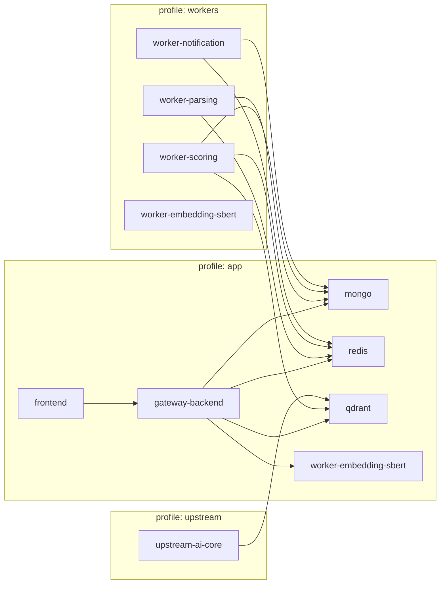

# CV-Matching Monorepo


Monorepo for CV matching workflows, including backend APIs, frontend apps, workers, and infrastructure.

## Quick Links

- Backend integration workflow: .github/workflows/backend-integration.yml
- Frontend quality workflow: .github/workflows/frontend-quality.yml
- Docker smoke workflow: .github/workflows/docker-smoke.yml
- Docker prod smoke workflow: .github/workflows/docker-prod-smoke.yml
- Production compose override: docker-compose.prod.yml
- Task log: task-completed.md
- Backend app: apps/backend
- Frontend app: apps/frontend

## Quick Start (Daily Dev Flow)

### Backend

1. Start infrastructure dependencies:

```powershell
docker compose --profile app up -d mongo redis qdrant worker-embedding-sbert
```

2. Run backend in watch mode:

```powershell
cd apps/backend
npm install
npm run dev
```

3. Verify backend health:

```powershell
node -e "fetch('http://127.0.0.1:3001/api/health').then((r)=>console.log(r.status)).catch((e)=>{console.error(e);process.exit(1);})"
```

### Frontend

1. Keep backend running on port `3001`.
2. Run frontend in dev mode:

```powershell
cd apps/frontend
npm install
npm run dev -- --hostname 0.0.0.0 --port 3000
```

3. Open UI:
- http://localhost:3000

### Full Stack (One Command)

```powershell
docker compose --profile app up -d --build
```

### Daily Dev Scripts (PowerShell)

```powershell
./scripts/dev-up.ps1
./scripts/dev-smoke.ps1
./scripts/dev-logs.ps1 -Follow
./scripts/dev-down.ps1
./scripts/queue-inspect.ps1 -ShowSamples
./scripts/queue-replay-dlq.ps1 -Count 5 -DryRun
./scripts/queue-replay-dlq.ps1 -Count 5 -DryRun -AuditFile ./scripts/replay-audit.local.jsonl
./scripts/replay-audit-retention.ps1 -AuditFile ./scripts/replay-audit.local.jsonl -MaxLines 5000 -CompressArchive
```

Queue worker tuning knobs:
- `SCORING_QUEUE_MAX_RETRIES` (default: `3`)
- `SCORING_RETRY_BACKOFF_MODE` (`linear` or `exponential`, default: `linear`)
- `SCORING_RETRY_BACKOFF_MS` (base delay in ms, default: `1000`)
- `SCORING_RETRY_BACKOFF_MAX_MS` (delay cap in ms, default: `10000`)
- `SCORING_DLQ_NAME` (default: `application_scoring_queue_dlq`)
- `SCORING_METRICS_LOG_INTERVAL_MS` (worker heartbeat interval, default: `30000`)

## Service Profiles Map



## Run Locally (Backend Integration)

Prerequisites:
- Node.js 20+
- npm 10+
- Docker Desktop with Docker Compose

PowerShell (repo root):

```powershell
./scripts/run-backend-integration.ps1 2>&1 | Out-File -FilePath ./scripts/last-backend-integration.txt -Encoding utf8
```

What this wrapper does:
- Detects a reachable Mongo URI and exports `MONGO_URI` + `MONGO_URI_TEST`
- Starts required services (`redis`, `qdrant`, `worker-embedding-sbert`) with Docker Compose
- Bootstraps Qdrant collections
- Runs backend integration tests in `apps/backend`

## Run With Docker

The root compose file is [docker-compose.yml](docker-compose.yml).

One-command startup (backend + frontend + dependencies):

```powershell
docker compose --profile app up -d --build
```

After startup:
- Frontend: http://localhost:3000
- Backend health: http://localhost:3001/api/health

1. Start core app dependencies (Mongo, Redis, Qdrant, embedding worker):

```powershell
docker compose --profile app up -d mongo redis qdrant worker-embedding-sbert
```

2. Check service status and health:

```powershell
docker compose --profile app ps
```

3. Optional full local verification (infra + seed + integration):

```powershell
./scripts/full-verify.ps1
```

4. Stop and clean containers when done:

```powershell
docker compose --profile app down
```

Notes:
- `gateway-backend` and `frontend` now run directly in Docker via Node 20 containers (development mode).
- Dependencies are pre-installed in app images via `apps/backend/Dockerfile.dev` and `apps/frontend/Dockerfile.dev`.
- Use `docker compose --profile app up -d --build` after dependency updates to rebuild images.

## Production Profile (Minimal)

Production mode uses [docker-compose.prod.yml](docker-compose.prod.yml) as an override on top of [docker-compose.yml](docker-compose.yml).

- Backend image: `apps/backend/Dockerfile.prod` (Node 20, `npm ci --omit=dev`, `npm run start`)
- Frontend image: `apps/frontend/Dockerfile.prod` (multi-stage build, Next.js standalone, `node server.js`)

Start production profile:

```powershell
docker compose -f docker-compose.yml -f docker-compose.prod.yml --profile app up -d --build
```

Stop production profile:

```powershell
docker compose -f docker-compose.yml -f docker-compose.prod.yml --profile app down
```

Script shortcuts:

```powershell
./scripts/dev-up.ps1 -Prod
./scripts/dev-smoke.ps1 -Prod
./scripts/dev-logs.ps1 -Prod -Follow
./scripts/dev-down.ps1 -Prod
```

Production CI gate:
- `.github/workflows/docker-prod-smoke.yml`

Privacy + AI provider policy:
- Recruiter/Admin can configure `privacy_mode` in Settings.
- Modes:
	- `hybrid`: allow both cloud providers and local Ollama.
	- `local_only`: restrict provider usage to Ollama/local endpoints.
	- `cloud_only`: block Ollama and enforce cloud-provider usage.
- AI generation endpoints (tailor, enrichment, cover letter, outreach) enforce this policy at runtime.
- System Status now shows active `llm_provider` and `privacy_mode` for quick diagnostics.

## CI Troubleshooting

If backend CI fails in `.github/workflows/backend-integration.yml`:

1. Download artifact `backend-integration-log` from the failed run.
2. If failure is in matrix job `isolated-critical`, download `isolated-integration-log-<test_file>` for the exact failing test.
3. Compare with your latest local log in [scripts/last-backend-integration.txt](scripts/last-backend-integration.txt).
4. Reproduce with the same test command in `apps/backend/tests/integration` and env values from the workflow.

## Docker Troubleshooting Checklist

### 1) Port Conflict

- Symptom: container fails to start with `port is already allocated`.
- Check current bindings:

```powershell
docker compose --profile app ps
```

- Fix options:
- Stop old stack: `docker compose --profile app down`
- Stop external process on the same port (`3000`, `3001`, `27017`, `6379`, `6333`, `8010`)
- Remap ports in [docker-compose.yml](docker-compose.yml) if needed.

### 2) Healthcheck Timeout

- Symptom: service stays `starting` or becomes `unhealthy`.
- Quick checks:

```powershell
docker compose --profile app ps
docker compose --profile app logs --tail 200 gateway-backend frontend worker-embedding-sbert qdrant mongo redis
```

- Fix options:
- Rebuild app images after dependency/code changes: `docker compose --profile app up -d --build`
- Ensure machine has enough CPU/RAM for first startup
- Retry from clean state: `docker compose --profile app down` then `docker compose --profile app up -d --build`.

### 3) Missing Environment Variables

- Symptom: app boots but fails DB/vector/API connectivity.
- Check effective config:

```powershell
docker compose -f docker-compose.yml config
```

- Fix options:
- Create/update root `.env` from `.env.example`
- Set credentials consistently (for example `MONGO_ROOT_USERNAME`, `MONGO_ROOT_PASSWORD`)
- Restart stack to apply env updates: `docker compose --profile app up -d --build`.

### 4) Queue Backlog / DLQ Growth

- Symptom: applications remain `pending` or scoring takes too long.
- Inspect queue and dead-letter depth:

```powershell
./scripts/queue-inspect.ps1 -ShowSamples
```

- If DLQ is growing quickly:
- verify worker token consistency (`WORKER_INTERNAL_TOKEN`) between backend and worker
- verify internal endpoint reachability from worker (`BACKEND_INTERNAL_BASE_URL`)
- tune retry strategy with `SCORING_RETRY_BACKOFF_MODE` and retry/backoff settings
- replay recovered messages cautiously after root-cause fix:

```powershell
./scripts/queue-replay-dlq.ps1 -Count 5 -DryRun
./scripts/queue-replay-dlq.ps1 -Count 5
./scripts/queue-replay-dlq.ps1 -ApplicationId <app_id> -MaxAgeMinutes 30 -Count 5 -DryRun
./scripts/queue-replay-dlq.ps1 -ApplicationId <app_id> -Count 2 -Actor <operator_name>
./scripts/queue-replay-dlq.ps1 -Count 2 -DryRun -AuditFile ./scripts/replay-audit.local.jsonl
```

Replay audit output:
- `queue-replay-dlq.ps1` now emits one structured JSON audit line with timestamp, actor, filters, and replay counts.
- audit payload includes `webhook_delivery` metadata (`delivery_mode`, `result_bucket`, `terminal_state`, `attempted`, `max_attempts`, `state_transition_count`, `status_transition_window_size`, `last_transition_at_utc`, `attempt_status_sequence`, `attempt_status_sequence_count`, `attempt_status_sequence_is_empty`, `attempt_status_sequence_last_index`, `attempt_status_sequence_tail_status`, `attempt_status_sequence_tail_status_present`, `attempt_status_sequence_tail_status_expected`, `attempt_status_sequence_tail_status_deviation`, `attempt_status_sequence_tail_status_consistent`, `attempt_status_sequence_tail_status_consistency_reason`, `attempt_status_sequence_tail_status_consistency_reason_code`, `attempt_status_sequence_tail_matches_final`, `attempt_status_sequence_window_utilization_ratio`, `attempt_status_sequence_window_headroom`, `attempt_status_sequence_consistent`, `attempt_status_sequence_truncated`, `sent`, `final_status`, `last_status_code`, `timeout_seconds`, `duration_ms`, `total_backoff_ms`, `endpoint_host`, `endpoint_host_classification`, `attempt_errors`, `last_error_at_utc`, `last_success_at_utc`, `success_after_retry`, `retry_count`, `final_error_code`, `error_family`) for delivery diagnostics.
- `delivery_mode` indicates high-level webhook path (`not_configured`, `attempted`, `throttled`).
- Optional file export: use `-AuditFile <path>` to append JSON lines for incident timelines and handoff notes.
- Use this output in incident tickets to preserve replay traceability.
- Optional webhook alert delivery is supported with signed/authenticated headers:
- `-WebhookUrl` to send replay audit event payloads
- `-WebhookSigningSecret` for HMAC SHA-256 signature + timestamp headers (`X-CV-Replay-Signature`, `X-CV-Replay-Timestamp` by default)
- `-WebhookAuthHeaderName` + `-WebhookAuthToken` for static receiver auth header
- Optional webhook idempotency support:
- `-WebhookIdempotencyHeader` to set receiver idempotency header name (default `X-CV-Replay-Idempotency-Key`)
- `-WebhookIdempotencyKey` to pass an explicit dedupe key (defaults to deterministic SHA-256 hash of payload JSON)
- Optional webhook throttling:
- `-WebhookMinIntervalSeconds` prevents replay alert bursts during large replay operations
- `-WebhookThrottleStateFile` stores last webhook-send timestamp for interval checks
- Optional webhook delivery retries:
- `-WebhookMaxAttempts` sets send attempts for transient receiver failures (default `1`)
- `-WebhookRetryBackoffMs` sets base retry backoff with exponential growth and cap
- `-WebhookRetryJitterMs` adds randomized jitter per retry to reduce concurrent retry spikes
- Optional webhook timeout:
- `-WebhookTimeoutSeconds` sets HTTP request timeout per webhook attempt (default `10`)

Replay audit retention:
- Use `./scripts/replay-audit-retention.ps1 -AuditFile <path> -MaxLines 5000` to rotate large JSONL logs.
- Add `-CompressArchive` to zip archived snapshots after rotation.
- Automation examples:
- Windows Task Scheduler (daily at 02:15):
```powershell
schtasks /Create /SC DAILY /ST 02:15 /TN "CVM Replay Audit Retention" /TR "powershell -NoProfile -ExecutionPolicy Bypass -File \"D:\Project\CV Matching\CV-Matching\scripts\replay-audit-retention.ps1\" -AuditFile \"D:\Project\CV Matching\CV-Matching\scripts\replay-audit.local.jsonl\" -MaxLines 5000 -CompressArchive"
```
- Linux cron (daily at 02:15):
```bash
15 2 * * * /usr/bin/pwsh -NoProfile -File /workspace/CV-Matching/scripts/replay-audit-retention.ps1 -AuditFile /workspace/CV-Matching/scripts/replay-audit.local.jsonl -MaxLines 5000 -CompressArchive
```

Worker metrics endpoint (optional):
- Set `SCORING_METRICS_PORT` to enable `GET /health` and `GET /metrics` on the scoring worker process.
- Example (inside compose env): `SCORING_METRICS_PORT=8091`

### 5) Queue/DLQ Alert Thresholds

Suggested baseline thresholds for local/CI/runtime monitoring:
- `queue_depth > 50` for more than 5 minutes: investigate worker throughput and internal endpoint latency.
- `queue_depth > 200` at any point: treat as urgent backlog and scale/inspect worker immediately.
- `dlq_depth > 0` after deployment: investigate failed scoring path before replaying.
- `dlq_depth growth >= 10 in 10 minutes`: incident-level signal; pause replay until root cause is fixed.
- heartbeat missing for >2 x `SCORING_METRICS_LOG_INTERVAL_MS`: worker may be stalled or down.

Replay guardrails:
- Use `-ApplicationId` to replay only specific applications after targeted remediation.
- Use `-MaxAgeMinutes` to avoid replaying stale poison messages.
- Always run with `-DryRun` first to inspect candidate payloads.

Replay-audit threshold profiles:
- CI guard supports profile-based thresholds (`REPLAY_AUDIT_PROFILE=local|ci|staging`) with optional explicit overrides:
- `REPLAY_AUDIT_MAX_EXECUTED`
- `REPLAY_AUDIT_MAX_NO_OP`
- `REPLAY_AUDIT_MIN_DRY_RUN`
- Runner-class presets in CI:
- `RUNNER_CLASS=github-hosted` (default): more tolerant synthetic baseline (`warn` mode)
- `RUNNER_CLASS=self-hosted`: tighter synthetic baseline (`enforce` mode)
- `SCORING_WARN_STREAK_FAIL` is auto-set by runner class (`false` for `github-hosted`, `true` for `self-hosted`)

Synthetic load calibration:
- Run `npm run test:integration:queue-load` in `apps/backend` with `RUN_INTEGRATION_TESTS=1` to simulate sustained worker failures and validate queue-to-DLQ behavior.
- Run `npm run test:integration:queue-variants` to compare `network_error` and `internal_service_error` DLQ classification under controlled load.
- `test:integration:queue-load` now profiles multiple load tiers (`50`, `200`, `500`) and prints throughput snapshots in test output.
- Optional load-tier override:
```powershell
$env:SCORING_SYNTHETIC_LOAD_TIERS="50,200,500"; npm run test:integration:queue-load
```
- Optional throughput baseline regression guard:
```powershell
$env:SCORING_SYNTHETIC_BASELINE_TPS_JSON='{"50":120,"200":110,"500":90}'; $env:SCORING_SYNTHETIC_MAX_DROP_PCT="45"; npm run test:integration:queue-load
```
- Slow/shared runner exception mode (warning only):
```powershell
$env:SCORING_SYNTHETIC_BASELINE_EXCEPTION_MODE="warn"; $env:SCORING_SYNTHETIC_BASELINE_EXCEPTION_REASON="shared-runner-hotspot"; npm run test:integration:queue-load
```
- Historical throughput capture pattern:
```powershell
$env:RUN_INTEGRATION_TESTS="1"; $env:SCORING_SYNTHETIC_LOAD_TIERS="50,200,500"; npm run test:integration:queue-load 2>&1 | Tee-Object -FilePath ./scripts/queue-load-trend.log
```
- Extract JSON snapshots for trend dashboards:
```powershell
Get-Content ./scripts/queue-load-trend.log | Select-String "\[queue-synthetic-load-json\]" | ForEach-Object { $_.Line }
```
- Append extracted snapshots to durable JSONL:
```powershell
./scripts/queue-load-snapshot-append.ps1 -InputLogFile ./scripts/queue-load-trend.log -OutputJsonl ./scripts/queue-load-trend.jsonl
```
- CI trend artifact:
- backend CI now uploads `queue-load-trend` artifact containing:
- `scripts/queue-load-trend.log`
- `scripts/queue-load-trend.jsonl`
- `scripts/queue-load-trend-history-<runner-class>.jsonl` (for example `github-hosted`, `self-hosted`)
- `scripts/queue-load-baseline-suggestion.json` (when enough samples exist)
- CI normalizes `scripts/queue-load-trend-history-<runner-class>.jsonl` each run:
- de-duplicates identical JSONL lines
- retains only the last `SCORING_TREND_HISTORY_MAX_LINES` entries (default `3000`)
- Cache restore fallback strategy:
- on new branches, workflows first try branch key
- if missing, they restore from default-branch trend cache key

Automatic baseline suggestion:
- Use `./scripts/queue-load-baseline-suggest.ps1` to compute candidate baseline medians from trend JSONL.
- CI computes suggestions from `scripts/queue-load-trend-history-<runner-class>.jsonl` (restored/saved per branch via GitHub Actions cache).
- CI can also load baseline defaults from `scripts/queue-load-baseline-current.json` using runner-class key (`github-hosted` / `self-hosted`).
- Backend integration workflow supports manual runner-class override via `workflow_dispatch` input `runner_class`.
- Baseline suggestion output now includes `confidence_by_tier` (sample count, p25/p75, IQR, relative IQR %, confidence score).
- Example:
```powershell
./scripts/queue-load-baseline-suggest.ps1 -InputJsonl ./scripts/queue-load-trend-history-github-hosted.jsonl -MinSamplesPerTier 5 -OutputJson ./scripts/queue-load-baseline-suggestion.json
```

Warn-mode regression watch:
- Use `./scripts/queue-load-regression-watch.ps1` to detect repeated warn-mode regressions and emit CI warnings.
- Optional strict mode (`-FailOnStreak`) fails when streak threshold is breached.
- Optional webhook delivery (`-WebhookUrl`) sends an alert payload when threshold is breached.
- Webhook payload can include context fields: commit SHA, workflow run URL, repository/ref, and runner class.
- Optional webhook verification/auth support:
- `-WebhookSigningSecret` adds HMAC SHA-256 signature + timestamp headers (`X-CV-Queue-Signature`, `X-CV-Queue-Timestamp` by default)
- `-WebhookAuthHeaderName` + `-WebhookAuthToken` add static auth header when required by receiver
- Example:
```powershell
./scripts/queue-load-regression-watch.ps1 -TrendJsonl ./scripts/queue-load-trend-history-github-hosted.jsonl -WarnStreakThreshold 3 -FailOnStreak -WebhookUrl "https://hooks.example.local/queue-load" -WebhookSigningSecret "topsecret" -WebhookAuthHeaderName "Authorization" -WebhookAuthToken "Bearer token" -CommitSha "abc123" -WorkflowRunUrl "https://github.com/org/repo/actions/runs/1" -Repository "org/repo" -RefName "main" -RunnerClass "github-hosted"
```

Rolling baseline recalibration (recommended):
- Collect `queue-load-trend.jsonl` from the last 10 successful CI runs.
- For each tier (`50`, `200`, `500`), compute median `throughputPerSecond`.
- Set `SCORING_SYNTHETIC_BASELINE_TPS_JSON` to those medians and keep `SCORING_SYNTHETIC_MAX_DROP_PCT` conservative (for example `35` to `45`).
- Recalibrate after infra or dependency changes that materially affect runtime performance.

Nightly baseline calibration (automated):
- Workflow: `.github/workflows/queue-load-baseline-calibration.yml`
- Trigger: scheduled daily run + manual `workflow_dispatch`
- Manual runs can set `runner_class` input (`github-hosted` or `self-hosted`).
- Manual runs can set `create_pull_request=false` for suggestion-only artifact runs (no baseline PR opened).
- Manual runs can set `confidence_override_tiers` input (comma-separated tier list) for controlled migrations.
- Branch policy:
- baseline apply is allowed on default branch by default
- non-default branch apply is blocked unless `workflow_dispatch` sets `allow_non_default_apply=true`
- Behavior:
- computes baseline suggestion from trend history (minimum sample gate)
- updates `scripts/queue-load-baseline-current.json` for configured runner class
- guardrails avoid noisy churn:
- minimum significant delta percentage required
- maximum delta sanity cap to block outlier auto-updates
- adaptive minimum confidence-score gate by branch/run type:
- default threshold for typical runs
- stricter threshold for scheduled default-branch runs
- relaxed threshold for non-default branches/manual experimentation
- optional per-tier confidence override allow-list (`confidence_override_tiers`) exempts selected tiers from confidence blocking
- opens an automated PR only when guardrails pass and baseline file meaningfully changes
- emits calibration decision artifact (`scripts/queue-load-baseline-calibration-decision.json`) with applied/skipped reason, delta counters, per-tier old/new/delta% summary, and annotations (`environment_profile`, `threshold_profile`)
- decision artifact includes `schema_version` for downstream compatibility checks (current: `1.0.0`)
- decision artifact includes `sample_counts_by_tier` to pair throughput deltas with confidence sample volume
- decision artifact includes `blocked_tiers` to show which tiers triggered skip decisions for guarded auto-apply reasons
- decision artifact includes blocked-reason counters (`blocked_low_confidence`, `blocked_outlier`, `blocked_below_threshold`) for quick dashboard aggregation
- decision artifact includes `blocked_ratio` (`blocked_tiers / candidate_tier_count`) for quick governance signals
- decision artifact includes `guardrail_trigger_count` summarizing block/no-op guardrails triggered during the run
- decision artifact includes `guardrail_trigger_types` as normalized guardrail category list for blocked/no-op runs
- decision artifact includes `guardrail_trigger_primary` for single-value primary guardrail filtering
- decision artifact includes `guardrail_trigger_total` as normalized total activation count for guardrail summary entries
- decision artifact includes `guardrail_trigger_total_consistent` (boolean) to mirror summary-total consistency checks
- decision artifact includes `guardrail_trigger_none_consistent` (boolean) for `none`/non-triggered coherence checks
- decision artifact includes `guardrail_consistency_all_passed` as aggregate consistency indicator across guardrail checks
- decision artifact includes `guardrail_consistency_hash` (SHA-256) for deterministic guardrail-consistency drift detection
- decision artifact includes `guardrail_consistency_hash_verified` for explicit pre-write hash verification status
- decision artifact includes `guardrail_consistency_validation_mode` to annotate guardrail validation profile (`strict-v1`)
- decision artifact includes `guardrail_consistency_contract_version` to track validation contract evolution (`guardrail-contract-v1`)
- decision artifact includes `guardrail_consistency_checks_total` and `guardrail_consistency_checks_passed` for explicit guardrail-check accounting
- decision artifact includes `guardrail_consistency_checks_failed` as a derived failed-check counter (`checks_total - checks_passed`) with non-negative contract enforcement
- decision artifact includes `guardrail_consistency_checks_profile` to label check-profile semantics used by the emitted consistency counters
- decision artifact includes `guardrail_consistency_checks_profile_version` to version check-profile semantics independently of profile naming
- decision artifact includes `guardrail_consistency_checks_profile_consistent` boolean to attest checks profile/version pairing integrity
- decision artifact includes `guardrail_consistency_checks_profile_signature` (for example, `strict-v1@1`) for compact profile/version identity checks
- decision artifact includes `guardrail_consistency_checks_profile_signature_verified` to confirm runtime recomputation checks for profile signature integrity
- decision artifact includes `guardrail_consistency_checks_profile_signature_source` (currently `derived`) for profile-signature provenance clarity
- decision artifact includes `guardrail_consistency_checks_profile_signature_consistent` boolean linking profile-signature value and provenance expectations
- decision artifact includes `guardrail_consistency_checks_profile_signature_pair` (for example, `strict-v1@1|derived`) to compact signature identity and provenance in one field
- decision artifact includes `guardrail_consistency_checks_profile_signature_pair_version` (`v1`) to version compact signature-pair semantics
- decision artifact includes `guardrail_consistency_checks_profile_signature_pair_version_source` (`derived`) to expose pair-version provenance
- decision artifact includes `guardrail_consistency_checks_profile_signature_pair_version_source_code` (`1` for `derived`) for compact pair-version source provenance encoding
- decision artifact includes `guardrail_consistency_checks_profile_signature_pair_version_source_code_valid` boolean (`code in {1}`) for explicit compact source-code domain validation
- decision artifact includes `guardrail_consistency_checks_profile_signature_pair_version_source_code_consistent` boolean to attest pair-version source/code parity (`derived <-> 1`)
- decision artifact includes `guardrail_consistency_checks_profile_signature_pair_version_source_consistent` boolean to attest pair-version source provenance integrity (`derived`)
- decision artifact includes `guardrail_consistency_checks_profile_signature_pair_version_consistent` boolean to attest pair-version contract integrity (`v1`)
- decision artifact includes `guardrail_consistency_checks_profile_signature_pair_consistent` boolean to attest pair-token recomputation integrity against signature and source fields
- decision artifact includes `guardrail_trigger_summary` (normalized category -> count map) for aggregation-ready guardrail reporting
- decision artifact includes `guardrail_triggered` (boolean) for quick blocked/no-op filtering in dashboards
- decision artifact validation enforces `guardrail_triggered=false` to imply `guardrail_trigger_total=0` and `guardrail_trigger_primary=none`
- decision artifact validation enforces `guardrail_triggered=true` to imply `guardrail_trigger_total>=1`
- decision artifact validation enforces `guardrail_trigger_total_consistent=true` in emitted decisions
- decision artifact validation enforces `guardrail_trigger_none_consistent` to match the equivalence: `guardrail_trigger_primary=none` iff `guardrail_triggered=false`
- decision artifact validation enforces `guardrail_trigger_none_consistent=true` in emitted decisions
- decision artifact validation enforces `guardrail_consistency_all_passed=true` in emitted decisions
- decision artifact validation enforces `guardrail_consistency_hash` as a 64-char lowercase hex digest
- decision artifact validation recomputes guardrail consistency hash before writes and asserts it equals emitted `guardrail_consistency_hash`
- decision artifact validation enforces `guardrail_consistency_hash_verified=true` in emitted decisions
- decision artifact includes `allowed_override_tiers` to explicitly persist confidence-gate bypass tier allow-list used for the run
- decision artifact includes `applied_tier_count` for quick summary of changed tiers when apply succeeds
- decision artifact includes `candidate_tier_count` for denominator context in decision analytics
- decision artifact includes `applied_ratio` (`applied_tier_count / candidate_tier_count`) for quick summary dashboards
- decision artifact includes `decision_outcome_bucket` (`applied`, `blocked`, `no_op`) for normalized automation result families
- decision artifact includes `decision_reason_family` (`applied`, `policy`, `input`, `threshold`, `confidence`, `none`) for grouped reason analytics
- decision artifact includes `decision_reason_code_normalized` for stable machine-friendly reason-code taxonomy
- decision artifact includes `decision_elapsed_ms` to track calibration decision runtime cost
- decision artifact includes `changed_tiers` as a concise sorted list of significant tiers when apply succeeds
- decision artifact includes `unchanged_tiers` to complement changed-tier summaries in review output
- validates calibration decision artifact format in CI to catch schema drift early

Replay-audit CI wiring checks:
- backend integration workflow now asserts replay dry-run argument wiring against configured secrets before invoking replay script.
- replay-audit JSON validation rejects final emitted payloads with `webhook_delivery.final_status=pending`.
- when replay webhook URL is configured, replay-audit validation also requires `webhook_delivery.endpoint_host_classification`.
- replay-audit validation requires `webhook_delivery.attempt_errors` to be an array for both success and failure paths.
- replay-audit validation requires `webhook_delivery.endpoint_host` when `endpoint_host_classification` is present.
- replay-audit validation requires `webhook_delivery.last_success_at_utc` when `webhook_delivery.sent=true`.
- replay-audit validation requires `webhook_delivery.success_after_retry=true` only when `webhook_delivery.attempted > 1`.
- replay-audit validation requires `webhook_delivery.retry_count == max(0, webhook_delivery.attempted - 1)`.
- replay-audit validation requires `webhook_delivery.delivery_mode=throttled` to imply `webhook_delivery.final_status=throttled`.
- replay-audit validation requires `webhook_delivery.delivery_mode=not_configured` to imply `webhook_delivery.configured=false`.
- replay-audit validation requires `webhook_delivery.final_status=success` to imply `webhook_delivery.final_error_code=null`.
- replay-audit validation requires `webhook_delivery.result_bucket=success` to imply `webhook_delivery.sent=true`.
- replay-audit validation requires `webhook_delivery.terminal_state=success` to imply `webhook_delivery.final_status=success`.
- replay-audit validation requires `webhook_delivery.state_transition_count=0` when `webhook_delivery.delivery_mode=not_configured`.
- replay-audit validation requires `webhook_delivery.terminal_state=throttled` to imply `webhook_delivery.delivery_mode=throttled`.
- replay-audit validation requires non-empty `webhook_delivery.attempt_status_sequence` to end with `webhook_delivery.final_status`.
- replay-audit validation requires `webhook_delivery.attempt_status_sequence_truncated=true` to imply `webhook_delivery.state_transition_count > webhook_delivery.status_transition_window_size`.
- replay-audit validation requires `webhook_delivery.attempt_status_sequence_truncated=false` to imply `webhook_delivery.state_transition_count <= webhook_delivery.status_transition_window_size`.
- replay-audit validation requires non-empty `webhook_delivery.attempt_status_sequence` to satisfy `webhook_delivery.attempt_status_sequence_last_index = (sequence length - 1)`.
- replay-audit validation requires empty `webhook_delivery.attempt_status_sequence` to imply `webhook_delivery.attempt_status_sequence_last_index = -1`.
- replay-audit validation requires `webhook_delivery.attempt_status_sequence_count = (webhook_delivery.attempt_status_sequence | length)`.
- replay-audit validation requires `webhook_delivery.attempt_status_sequence_is_empty == ((webhook_delivery.attempt_status_sequence | length) == 0)`.
- replay-audit validation requires `webhook_delivery.attempt_status_sequence_consistent=true`.
- replay-audit validation requires non-empty sequence to imply `webhook_delivery.attempt_status_sequence_tail_status == webhook_delivery.final_status`.
- replay-audit validation requires empty sequence to imply `webhook_delivery.attempt_status_sequence_tail_status=null`.
- replay-audit validation requires non-empty sequence to imply `webhook_delivery.attempt_status_sequence_tail_status` is non-null.
- replay-audit validation requires `webhook_delivery.attempt_status_sequence_tail_matches_final=true`.
- replay-audit validation requires `webhook_delivery.attempt_status_sequence_tail_status_present == ((webhook_delivery.attempt_status_sequence | length) > 0)`.
- replay-audit validation requires `webhook_delivery.attempt_status_sequence_tail_status_deviation=false`.
- replay-audit validation requires `webhook_delivery.attempt_status_sequence_tail_status_consistent=true`.
- replay-audit validation requires `webhook_delivery.attempt_status_sequence_tail_status_consistency_reason="ok"`.
- replay-audit validation requires `webhook_delivery.attempt_status_sequence_tail_status_consistency_reason_code=0`.
- replay-audit metadata includes `webhook_delivery.attempt_status_sequence_tail_status_consistency_reason_source` (`derived`|`validated`) for reason provenance.
- replay-audit metadata includes `webhook_delivery.attempt_status_sequence_tail_status_consistency_reason_scope` (`tail_only`|`tail_and_final`) for consistency-evaluation scope tagging.
- replay-audit metadata includes `webhook_delivery.attempt_status_sequence_tail_status_consistency_reason_scope_code` (`0` for `tail_only`, `1` for `tail_and_final`) for compact telemetry consumers.
- replay-audit metadata includes `webhook_delivery.attempt_status_sequence_tail_status_consistency_reason_scope_code_valid` boolean (`code in {0,1}`) for compact-code domain checks.
- replay-audit metadata includes `webhook_delivery.attempt_status_sequence_tail_status_consistency_reason_scope_consistent` boolean to assert scope label/code parity.
- replay-audit metadata includes `webhook_delivery.attempt_status_sequence_tail_status_consistency_reason_scope_code_matches_scope` boolean alias for scope parity readability.
- replay-audit metadata includes `webhook_delivery.attempt_status_sequence_tail_status_consistency_reason_scope_label_code_pair` (for example, `tail_only:0`) for compact dimensional aggregation.
- replay-audit metadata includes `webhook_delivery.attempt_status_sequence_tail_status_consistency_reason_scope_pair_consistent` boolean to attest pair-string parity against scope/code fields.
- replay-audit metadata includes `webhook_delivery.attempt_status_sequence_tail_status_consistency_reason_scope_pair_source` (`derived`) for pair-string provenance clarity.
- replay-audit metadata includes `webhook_delivery.attempt_status_sequence_tail_status_consistency_reason_scope_pair_version` (`v1`) to version compact scope pair semantics.
- replay-audit metadata includes `webhook_delivery.attempt_status_sequence_tail_status_consistency_reason_scope_pair_version_source` (`derived`) to track scope-pair version provenance.
- replay-audit metadata includes `webhook_delivery.attempt_status_sequence_tail_status_consistency_reason_scope_pair_version_source_code` (`1` for `derived`) for compact scope-pair version-source provenance encoding.
- replay-audit metadata includes `webhook_delivery.attempt_status_sequence_tail_status_consistency_reason_scope_pair_version_source_code_valid` boolean (`code in {1}`) for compact version-source code domain checks.
- replay-audit metadata includes `webhook_delivery.attempt_status_sequence_tail_status_consistency_reason_scope_pair_version_source_code_matches_source` boolean alias for compact source/code parity readability.
- replay-audit metadata includes `webhook_delivery.attempt_status_sequence_tail_status_consistency_reason_scope_pair_version_source_code_matches_source_consistent` boolean to attest alias/equivalence integrity against canonical source/code parity computation.
- replay-audit metadata includes `webhook_delivery.attempt_status_sequence_tail_status_consistency_reason_scope_pair_version_source_consistent` boolean to attest version-source provenance integrity (`derived`).
- replay-audit metadata includes `webhook_delivery.attempt_status_sequence_tail_status_consistency_reason_scope_pair_version_consistent` boolean to attest scope-pair version compatibility with the `v1` contract.
- replay-audit validation requires non-empty `webhook_delivery.attempt_status_sequence_tail_status_consistency_reason_detail` whenever `webhook_delivery.attempt_status_sequence_tail_status_consistency_reason_code != 0`.
- replay-audit validation requires `webhook_delivery.attempt_status_sequence_tail_status_consistency_reason_source="derived"` whenever `webhook_delivery.attempt_status_sequence_tail_status_consistency_reason_code=0`.
- replay-audit validation requires `webhook_delivery.attempt_status_sequence_tail_status_consistency_reason_scope="tail_and_final"` whenever `webhook_delivery.attempt_status_sequence` is non-empty.
- replay-audit validation requires `webhook_delivery.attempt_status_sequence_tail_status_consistency_reason_scope_code=1` whenever `webhook_delivery.attempt_status_sequence` is non-empty.
- replay-audit validation requires `webhook_delivery.attempt_status_sequence_tail_status_consistency_reason_scope_consistent=true` for all emitted records.
- replay-audit validation requires `webhook_delivery.attempt_status_sequence_tail_status_consistency_reason_scope_label_code_pair == (scope + ":" + tostring(scope_code))`.
- replay-audit validation requires `webhook_delivery.attempt_status_sequence_tail_status_consistency_reason_scope_code_matches_scope == webhook_delivery.attempt_status_sequence_tail_status_consistency_reason_scope_consistent`.
- replay-audit validation requires `webhook_delivery.attempt_status_sequence_tail_status_consistency_reason_scope_pair_version="v1"`.
- replay-audit validation requires `webhook_delivery.attempt_status_sequence_tail_status_consistency_reason_scope_pair_source="derived"`.
- replay-audit validation requires `webhook_delivery.attempt_status_sequence_tail_status_consistency_reason_scope_pair_source="derived"` whenever `webhook_delivery.attempt_status_sequence_tail_status_consistency_reason_scope_pair_consistent=true`.
- replay-audit validation requires `webhook_delivery.attempt_status_sequence_tail_status_consistency_reason_scope_pair_version="v1"` whenever `webhook_delivery.attempt_status_sequence_tail_status_consistency_reason_scope_pair_consistent=true`.
- replay-audit validation requires `webhook_delivery.attempt_status_sequence_tail_status_consistency_reason_scope_pair_version_source="derived"` whenever `webhook_delivery.attempt_status_sequence_tail_status_consistency_reason_scope_pair_version_consistent=true`.
- replay-audit validation requires `webhook_delivery.attempt_status_sequence_tail_status_consistency_reason_scope_pair_version_source_consistent=true`.
- replay-audit validation requires `webhook_delivery.attempt_status_sequence_tail_status_consistency_reason_scope_pair_version_source_code=1` whenever `webhook_delivery.attempt_status_sequence_tail_status_consistency_reason_scope_pair_version_source_consistent=true`.
- replay-audit validation requires `webhook_delivery.attempt_status_sequence_tail_status_consistency_reason_scope_pair_version_source_code_valid=true`.
- replay-audit validation requires `webhook_delivery.attempt_status_sequence_tail_status_consistency_reason_scope_pair_version_source_code_matches_source=true`.
- replay-audit validation requires `webhook_delivery.attempt_status_sequence_tail_status_consistency_reason_scope_pair_version_source_code_matches_source_consistent=true`.
- replay-audit validation requires `webhook_delivery.attempt_status_sequence_tail_status_consistency_reason_scope_pair_version_source_code_valid == (webhook_delivery.attempt_status_sequence_tail_status_consistency_reason_scope_pair_version_source_code == 1)`.
- replay-audit validation requires `webhook_delivery.attempt_status_sequence_tail_status_consistency_reason_scope_pair_version_source_code_matches_source == ((webhook_delivery.attempt_status_sequence_tail_status_consistency_reason_scope_pair_version_source == "derived") and (webhook_delivery.attempt_status_sequence_tail_status_consistency_reason_scope_pair_version_source_code == 1))`.
- replay-audit validation requires `webhook_delivery.attempt_status_sequence_tail_status_consistency_reason_scope_pair_version_source_code_matches_source_consistent == (webhook_delivery.attempt_status_sequence_tail_status_consistency_reason_scope_pair_version_source_code_matches_source == ((webhook_delivery.attempt_status_sequence_tail_status_consistency_reason_scope_pair_version_source == "derived") and (webhook_delivery.attempt_status_sequence_tail_status_consistency_reason_scope_pair_version_source_code == 1)))`.
- replay-audit validation requires `webhook_delivery.attempt_status_sequence_tail_status_consistency_reason_scope_pair_version_source_code == 1` when `webhook_delivery.attempt_status_sequence_tail_status_consistency_reason_scope_pair_version_source="derived"`.

### 6) Failure-Type Routing Quick Guide

Use worker `failure_type` labels to speed up first response:
- `authorization_error`: check `WORKER_INTERNAL_TOKEN` alignment and endpoint auth middleware.
- `resource_not_found`: verify application existence and ID integrity in queue payloads.
- `internal_service_error`: inspect backend logs and recent deploy changes.
- `network_error`: inspect service DNS/ports, container health, and transient network issues.
- `processing_error`: inspect payload shape, validation rules, and deterministic repro path.
