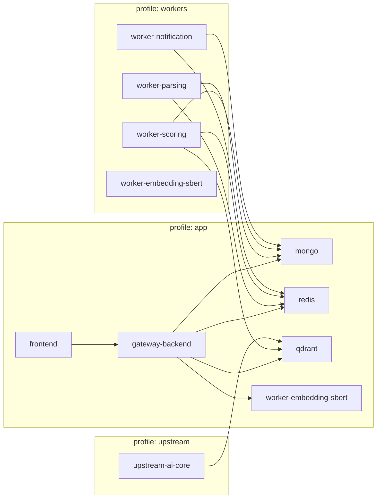

# CV-Matching Monorepo


Monorepo for CV matching workflows, including backend APIs, frontend apps, workers, and infrastructure.

## Quick Links

- Backend integration workflow: .github/workflows/backend-integration.yml
- Frontend quality workflow: .github/workflows/frontend-quality.yml
- Docker smoke workflow: .github/workflows/docker-smoke.yml
- Docker prod smoke workflow: .github/workflows/docker-prod-smoke.yml
- Production compose override: docker-compose.prod.yml
- Task log: task-completed.md
- Backend app: apps/backend
- Frontend app: apps/frontend

## Quick Start (Daily Dev Flow)

### Backend

1. Start infrastructure dependencies:

```powershell
docker compose --profile app up -d mongo redis qdrant worker-embedding-sbert
```

2. Run backend in watch mode:

```powershell
cd apps/backend
npm install
npm run dev
```

3. Verify backend health:

```powershell
node -e "fetch('http://127.0.0.1:3001/api/health').then((r)=>console.log(r.status)).catch((e)=>{console.error(e);process.exit(1);})"
```

### Frontend

1. Keep backend running on port `3001`.
2. Run frontend in dev mode:

```powershell
cd apps/frontend
npm install
npm run dev -- --hostname 0.0.0.0 --port 3000
```

3. Open UI:
- http://localhost:3000

### Full Stack (One Command)

```powershell
docker compose --profile app up -d --build
```

### Daily Dev Scripts (PowerShell)

```powershell
./scripts/dev-up.ps1
./scripts/dev-smoke.ps1
./scripts/dev-logs.ps1 -Follow
./scripts/dev-down.ps1
```

## Service Profiles Map



## Run Locally (Backend Integration)

Prerequisites:
- Node.js 20+
- npm 10+
- Docker Desktop with Docker Compose

PowerShell (repo root):

```powershell
./scripts/run-backend-integration.ps1 2>&1 | Out-File -FilePath ./scripts/last-backend-integration.txt -Encoding utf8
```

What this wrapper does:
- Detects a reachable Mongo URI and exports `MONGO_URI` + `MONGO_URI_TEST`
- Starts required services (`redis`, `qdrant`, `worker-embedding-sbert`) with Docker Compose
- Bootstraps Qdrant collections
- Runs backend integration tests in `apps/backend`

## Run With Docker

The root compose file is [docker-compose.yml](docker-compose.yml).

One-command startup (backend + frontend + dependencies):

```powershell
docker compose --profile app up -d --build
```

After startup:
- Frontend: http://localhost:3000
- Backend health: http://localhost:3001/api/health

1. Start core app dependencies (Mongo, Redis, Qdrant, embedding worker):

```powershell
docker compose --profile app up -d mongo redis qdrant worker-embedding-sbert
```

2. Check service status and health:

```powershell
docker compose --profile app ps
```

3. Optional full local verification (infra + seed + integration):

```powershell
./scripts/full-verify.ps1
```

4. Stop and clean containers when done:

```powershell
docker compose --profile app down
```

Notes:
- `gateway-backend` and `frontend` now run directly in Docker via Node 20 containers (development mode).
- Dependencies are pre-installed in app images via `apps/backend/Dockerfile.dev` and `apps/frontend/Dockerfile.dev`.
- Use `docker compose --profile app up -d --build` after dependency updates to rebuild images.

## Production Profile (Minimal)

Production mode uses [docker-compose.prod.yml](docker-compose.prod.yml) as an override on top of [docker-compose.yml](docker-compose.yml).

- Backend image: `apps/backend/Dockerfile.prod` (Node 20, `npm ci --omit=dev`, `npm run start`)
- Frontend image: `apps/frontend/Dockerfile.prod` (multi-stage build, Next.js standalone, `node server.js`)

Start production profile:

```powershell
docker compose -f docker-compose.yml -f docker-compose.prod.yml --profile app up -d --build
```

Stop production profile:

```powershell
docker compose -f docker-compose.yml -f docker-compose.prod.yml --profile app down
```

Script shortcuts:

```powershell
./scripts/dev-up.ps1 -Prod
./scripts/dev-smoke.ps1 -Prod
./scripts/dev-logs.ps1 -Prod -Follow
./scripts/dev-down.ps1 -Prod
```

Production CI gate:
- `.github/workflows/docker-prod-smoke.yml`

Privacy + AI provider policy:
- Recruiter/Admin can configure `privacy_mode` in Settings.
- Modes:
	- `hybrid`: allow both cloud providers and local Ollama.
	- `local_only`: restrict provider usage to Ollama/local endpoints.
	- `cloud_only`: block Ollama and enforce cloud-provider usage.
- AI generation endpoints (tailor, enrichment, cover letter, outreach) enforce this policy at runtime.
- System Status now shows active `llm_provider` and `privacy_mode` for quick diagnostics.

## CI Troubleshooting

If backend CI fails in `.github/workflows/backend-integration.yml`:

1. Download artifact `backend-integration-log` from the failed run.
2. If failure is in matrix job `isolated-critical`, download `isolated-integration-log-<test_file>` for the exact failing test.
3. Compare with your latest local log in [scripts/last-backend-integration.txt](scripts/last-backend-integration.txt).
4. Reproduce with the same test command in `apps/backend/tests/integration` and env values from the workflow.

## Docker Troubleshooting Checklist

### 1) Port Conflict

- Symptom: container fails to start with `port is already allocated`.
- Check current bindings:

```powershell
docker compose --profile app ps
```

- Fix options:
- Stop old stack: `docker compose --profile app down`
- Stop external process on the same port (`3000`, `3001`, `27017`, `6379`, `6333`, `8010`)
- Remap ports in [docker-compose.yml](docker-compose.yml) if needed.

### 2) Healthcheck Timeout

- Symptom: service stays `starting` or becomes `unhealthy`.
- Quick checks:

```powershell
docker compose --profile app ps
docker compose --profile app logs --tail 200 gateway-backend frontend worker-embedding-sbert qdrant mongo redis
```

- Fix options:
- Rebuild app images after dependency/code changes: `docker compose --profile app up -d --build`
- Ensure machine has enough CPU/RAM for first startup
- Retry from clean state: `docker compose --profile app down` then `docker compose --profile app up -d --build`.

### 3) Missing Environment Variables

- Symptom: app boots but fails DB/vector/API connectivity.
- Check effective config:

```powershell
docker compose -f docker-compose.yml config
```

- Fix options:
- Create/update root `.env` from `.env.example`
- Set credentials consistently (for example `MONGO_ROOT_USERNAME`, `MONGO_ROOT_PASSWORD`)
- Restart stack to apply env updates: `docker compose --profile app up -d --build`.
