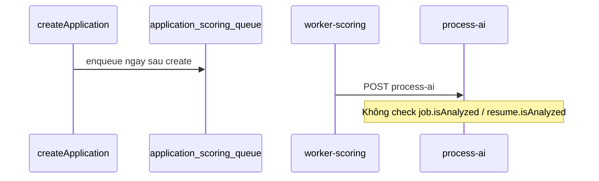
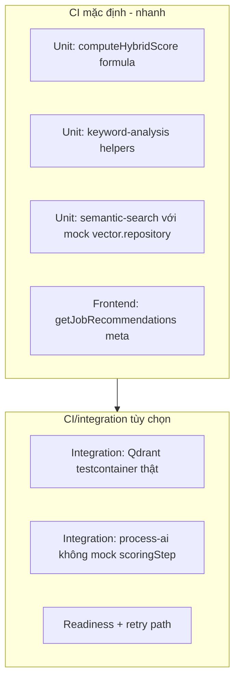
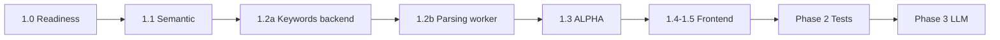

# Kế hoạch xử lý vấn đề AI / CV-JD Matching (v2)

Nguồn: [`issues/ai_cv_jd_matching_full_audit_2026-05-24.md`](issues/ai_cv_jd_matching_full_audit_2026-05-24.md)

**Phạm vi đã chốt:** Scoring + recommendations + tests trước; LLM generation ở phase sau (hybrid phase).

**Cập nhật v2:** Phản hồi review — race embedding/scoring, parsing worker bắt buộc, migration ALPHA, test strategy phân tầng, observability LLM, out-of-scope, điều chỉnh effort.

---

## Đánh giá nhận xét review

| # | Nhận xét | Đúng? | Ghi chú từ code |
|---|----------|-------|-----------------|
| 1 | Race embedding → scoring | **Có** | [`application.service.js`](apps/backend/src/services/application.service.js) `enqueueApplicationScoring` ngay sau `Application.create`, không check `job.isAnalyzed` / `resume.isAnalyzed`. Pipeline không có worker-embedding riêng cho apply; embedding gắn với create Job/Resume — nhưng scoring vẫn chạy khi vector chưa sẵn sàng. |
| 2 | Parsing worker quá nhẹ | **Có** | [`workers/parsing/app.py`](workers/parsing/app.py) vẫn `skills: []`. Backend fallback bắt buộc nhưng không thay thế parsing cải thiện. |
| 3 | ALPHA ảnh hưởng data cũ | **Có** | Đổi công thức chỉ áp dụng lần tính mới; Application `completed` cũ giữ `hybridScore` theo α=0.7 trừ khi recalc. |
| 4 | Test Qdrant: chọn một hướng | **Có** | Cần phân tầng: unit (mock) vs integration (container), không để mở "hoặc" cùng cấp. |
| 5 | Phase 3 thiếu observability | **Có** | `testLlmConfig` hiện chỉ config-level; cần timeout, log fallback, token metrics trước khi production. |
| 6 | Thiếu out-of-scope | **Có** | Tránh scope creep khi implement. |
| 7 | Effort Phase 1 underestimate | **Hợp lý** | 1.1 + readiness + edge cases dễ chiếm 3–4 ngày riêng. |

---

## Phạm vi không làm trong plan này (Out of scope)

- Không refactor toàn bộ kiến trúc worker (tách worker-embedding-sbert thành queue riêng cho Application) — chỉ **readiness + ensure-index/requeue** trong pipeline hiện có.
- Không đổi schema Qdrant collection (`jobs_vectors` / `resumes_vectors`, dim 384, payload shape).
- Không đổi contract HTTP của [`recommendation.controller.js`](apps/backend/src/controllers/recommendation.controller.js) (vẫn `{ request_id, data, meta }`); chỉ sửa client unwrap.
- Không recalculate hàng loạt toàn DB Application theo mặc định (xem mục 1.3).
- Không implement billing/cost cap tự động cho LLM (Phase 3 chỉ log + metric; alert là follow-up).
- Không sửa UC-RM-11 đa ngôn ngữ UI (đã xử lý riêng).
- Không thay đổi logic ranking theo status pipeline (vẫn sort `hybridScore` DESC).

---

## Tổng quan vấn đề (11 findings)

| # | Finding | Severity |
|---|---------|----------|
| 1 | Application scoring không dùng Qdrant (`semanticScore: 0`) | High |
| 2 | Keyword score thường 0 | High |
| 3 | ALPHA 0.65 vs code 0.7 | Medium |
| 4 | Frontend recommendations unwrap sai | High |
| 5 | Tests mock scoring | Medium |
| 6 | Seed vector giống nhau | Medium |
| 7–9 | Tailor / cover / interview template | High (Phase 3) |
| 10 | Recommendations bỏ `technicalSkills` | Medium |
| 11 | `user.name` vs `fullName` | Low–Medium |

---

## Phase 1 — Core scoring & ranking

### 1.0 Readiness: embedding phải sẵn sàng trước scoring (bổ sung — trước 1.1)

**Vấn đề:** Plan cũ chỉ nhắc rủi ro "vector chưa index" ở cuối; fallback embed on-the-fly không đủ làm chiến lược chính.

**Luồng hiện tại (đã xác minh):**

**Trách nhiệm (quyết định):** **`runApplicationAiPipeline`** (và helper mới `ensureVectorsReadyForScoring`) chịu trách nhiệm đảm bảo Job + Resume đã index trước khi gọi `computeSemanticScoreForPair`.

**Chiến lược 3 bước (theo thứ tự):**

1. **Readiness check** — Load Job/Resume; yêu cầu `isAnalyzed === true` và `qdrantId` hợp lệ; verify point tồn tại trong Qdrant (retrieve by id).
2. **Ensure-index (sync trong process-ai)** — Nếu chưa ready: gọi logic index hiện có (tái sử dụng [`embedding.service.js`](apps/backend/src/services/embedding.service.js) + upsert từ [`vector-index.service.js`](apps/backend/src/services/vector-index.service.js)), set `isAnalyzed`, rồi mới score.
3. **Requeue nếu vẫn fail** — Nếu SBERT/Qdrant down hoặc thiếu text: **không** lưu `completed` với score 0; đặt `aiStatus: pending` (hoặc giữ `scoring` tùy contract) và **ném lỗi có mã** (`vectors_not_ready`, `embedding_service_unavailable`) để [`workers/scoring/worker-core.js`](workers/scoring/worker-core.js) retry theo `maxRetries` / backoff đã có.

**Không làm:** Coi fallback embed on-the-fly là đường chính im lặng khi Qdrant trống — chỉ dùng sau bước ensure-index thất bại một phần (recovery), có log structured.

**File:** [`application-ai.service.js`](apps/backend/src/services/application-ai.service.js), có thể thêm `application-vector-readiness.service.js`, tùy chọn pre-check nhẹ ở [`application.service.js`](apps/backend/src/services/application.service.js) (warn log nếu apply khi resume chưa `ready`, vẫn enqueue).

**Test bắt buộc (Phase 2):** Case Job chưa analyzed → ensure-index → score; case Qdrant down → failed + retry count tăng.

---

### 1.1 Semantic score thật từ Qdrant (Finding 1)

**Phụ thuộc:** Hoàn thành 1.0.

- Thêm `computeSemanticScoreForPair({ jobId, resumeId })` trong [`semantic-search.service.js`](apps/backend/src/services/semantic-search.service.js):
  - Cosine từ 2 point Qdrant (hoặc search filtered theo `mongoId`).
  - Edge cases: thiếu `qdrantId`, point missing, dim mismatch → lỗi có mã (không return 0 im lặng).
- Default `scoringStep` trong `runApplicationAiPipeline`: semantic thật + `buildHybridScoreForPair` với [`HYBRID_SEMANTIC_WEIGHT`](apps/backend/src/constants/scoring.js).

**Effort riêng:** ~3–4 ngày (implementation + edge cases + test).

---

### 1.2 Keyword extraction — backend bắt buộc + parsing worker là deliverable Phase 1 (Finding 2, 10)

**Không còn "có thể làm song song".** Chia hai lớp với acceptance criteria rõ:

| Lớp | Phạm vi | Bắt buộc khi nào |
|-----|---------|------------------|
| **1.2a Backend** | Module `keyword-analysis.service.js`; gộp `skills` + `additional.technicalSkills` + fallback tokenize `rawText`; auto-fill `job.keywords` on create/update | **Trước merge Phase 1** |
| **1.2b Parsing worker** | [`workers/parsing/app.py`](workers/parsing/app.py): extract section Skills (regex/heading), map vào `skills` / `additional.technicalSkills` tối thiểu | **Cùng PR Phase 1** hoặc PR con liền kề (không defer sang Phase 2) |

**Lý do:** Audit gốc coi parsing là một trong hai root cause `keywordScore = 0`. Backend-only đủ cho demo nhưng production vẫn phụ thuộc upload path qua worker.

**Tích hợp:** `buildHybridScoreForPair`, [`recommendation.service.js`](apps/backend/src/services/recommendation.service.js), [`job.service.js`](apps/backend/src/services/job.service.js).

---

### 1.3 Chuẩn hóa ALPHA = 0.65 + quyết định data cũ (Finding 3)

**Hằng số:** `apps/backend/src/constants/scoring.js` — `HYBRID_SEMANTIC_WEIGHT = 0.65`, `HYBRID_KEYWORD_WEIGHT = 0.35`.

**Cập nhật default** backend + frontend (danh sách file như plan v1).

**Quyết định data lịch sử (chọn rõ, không để team tự đoán):**

| Phương án | Chọn? | Ghi chú |
|-----------|-------|---------|
| **A. Không recalc (default)** | **Có** | Application đã `completed` giữ `hybridScore` cũ (tính với α=0.7). Ranking chỉ nhất quán cho application **mới** sau deploy. Ghi trong changelog + admin note. |
| B. Recalc toàn bộ | Không (mặc định) | Tốn tài nguyên; thay đổi thứ hạng recruiter đột ngột. |
| C. Script optional | **Có (khuyến nghị)** | `apps/backend/scripts/recalculate-application-scores.mjs` — admin chạy thủ công khi cần đồng bộ; không chạy trong CI. |

**Không** tự động recalc on-read hoặc migration MongoDB trong deploy script trừ khi product yêu cầu rõ.

---

### 1.4 Sửa frontend recommendations API (Finding 4)

**Quyết định:** Mở rộng `ApiResult` / `request()` để giữ `meta` từ top-level response (không chỉ `pagination`).

- [`apps/frontend/lib/api.ts`](apps/frontend/lib/api.ts): `getJobRecommendations` / `getResumeRecommendations` dùng `result.data` + `result.meta`.
- Backend response shape giữ nguyên.

---

### 1.5 Bug `fullName` (Finding 11)

[`recommendation.service.js`](apps/backend/src/services/recommendation.service.js): `.select("fullName email")`, `user?.fullName`.

---

## Phase 2 — Tests, seed, verification

### 2.1 Chiến lược test (quyết định rõ — không "hoặc" mơ hồ)

| Tầng | Công cụ | Mục đích | Khi chạy |
|------|---------|----------|----------|
| **Unit** | Mock/inject `vector.repository` (hoặc stub `computeSemanticScoreForPair`) | Formula, keywords, readiness logic, không cần Docker | Mọi `npm test` backend |
| **Integration** | **Qdrant testcontainer** (docker-compose service `qdrant`) | Cosine thật, payload, dim 384, readiness | Chỉ khi `RUN_INTEGRATION_TESTS=1` |

**Không dùng:** Mock repository thay cho integration test chính — mock chỉ cho unit.

**File:** `application-scoring-qdrant.test.mjs`, sửa [`application-worker-processing.test.mjs`](apps/backend/tests/integration/application-worker-processing.test.mjs), document trong [`docs/instructions.md`](docs/instructions.md).

### 2.2 Seed (Finding 6)

[`seed-demo-data.mjs`](apps/backend/scripts/seed-demo-data.mjs): vectors khác nhau; comment "không dùng đánh giá chất lượng matching".

### 2.3 Checklist audit

Chạy checklist MongoDB/Qdrant/workers từ audit; ghi kết quả vào PR.

---

## Phase 3 — LLM generation (sau Phase 1–2)

Findings 7–9. Port [`upstream/.../app/llm/`](upstream/resume-matcher/apps/backend/app/llm/).

### 3.1 `llm.service.js`

Config từ [`config.service.js`](apps/backend/src/services/config.service.js); `assertAiGenerationAllowed`; providers theo privacy mode.

### 3.2 Generation features

Tailor, cover letter, outreach, interview, enrichment — LLM primary, template fallback.

### 3.3 Observability & error budget (bổ sung)

| Hạng mục | Giá trị đề xuất | Ghi chú |
|----------|-----------------|---------|
| **Timeout** | `LLM_REQUEST_TIMEOUT_MS` default **60_000** (env override) | Per request; abort + fallback template |
| **Retry** | Tối đa 1 retry cho 429/5xx | Exponential backoff 2s |
| **Log fallback** | Structured log `llm_generation_fallback` với `feature`, `reason` (`timeout`, `rate_limit`, `no_api_key`, `provider_error`) | Admin có thể audit trong logs |
| **Token usage** | Log `prompt_tokens`, `completion_tokens`, `model`, `provider` mỗi call thành công | Không hard cap trong plan này |
| **Cost alert** | Out of scope — follow-up (Datadog/monthly report) | Tránh production surprise |
| **UI** | Badge `AI-generated` vs `Template fallback` khi API trả `generation_mode` | Optional field trên response |

**Health check:** `testLlmConfig` gọi LLM thật (short completion) khi có key — không chỉ `config_validation_only`.

---

## Thứ tự triển khai

---

## Ước lượng effort (điều chỉnh)

| Phase | Effort | Ghi chú |
|-------|--------|---------|
| **Phase 1.0 + 1.1** | **4–6 ngày** | Readiness + Qdrant edge cases + tests unit |
| **Phase 1.2–1.5** | **2–3 ngày** | Keywords + parsing worker + ALPHA + frontend |
| **Tổng Phase 1** | **6–9 ngày** | Không còn 3–5 ngày |
| Phase 2 | 2–3 ngày | Testcontainer CI doc + integration suite |
| Phase 3 | 5–8 ngày | LLM + observability |

---

## Definition of Done

**Phase 1–2:**

- Application mới: readiness pass → `semanticScore` từ Qdrant; `hybridScore` với α=0.65.
- Vector chưa sẵn sàng: ensure-index hoặc requeue/retry — không `completed` với toàn 0 im lặng.
- Parsing worker trả skills không rỗng cho file mẫu có section Skills.
- Recommendations UI hiển thị data + meta.
- Unit tests pass mọi PR; integration Qdrant pass khi `RUN_INTEGRATION_TESTS=1`.

**Phase 3:**

- LLM path + fallback logged; timeout 60s documented.

---

## File then chốt (phase 1–2)

| File | Thay đổi |
|------|----------|
| `application-vector-readiness.service.js` | **Mới** — ensure-index, readiness |
| `application-ai.service.js` | Readiness + scoring thật |
| `semantic-search.service.js` | `computeSemanticScoreForPair` |
| `keyword-analysis.service.js` | **Mới** |
| `workers/parsing/app.py` | Extract skills (1.2b) |
| `constants/scoring.js` | ALPHA 0.65 |
| `scripts/recalculate-application-scores.mjs` | Optional admin |
| `frontend/lib/api.ts` | Meta unwrap |
| `recommendation.service.js` | Keywords + fullName |
| `seed-demo-data.mjs` | Diverse vectors |
| `tests/integration/*` | Unit + Qdrant container |
