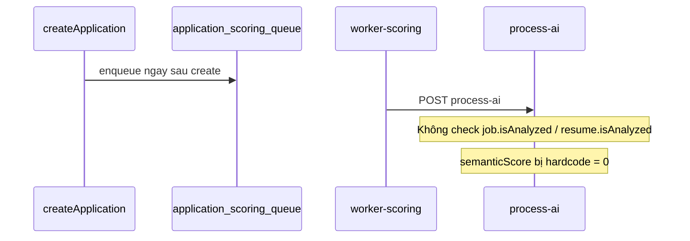
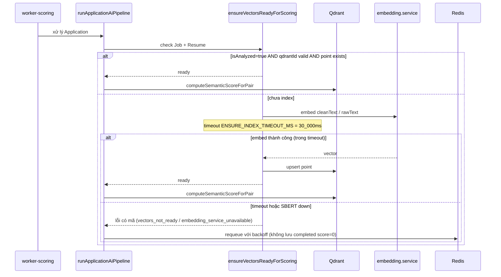
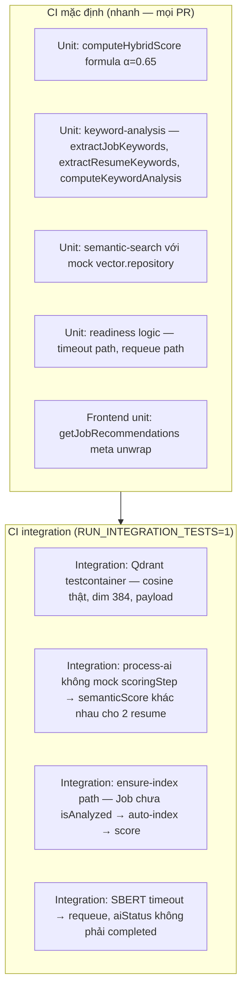
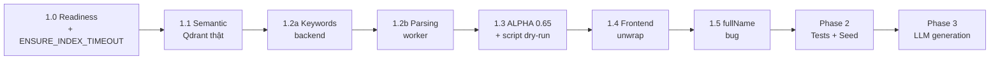

# Kế hoạch xử lý vấn đề AI / CV-JD Matching (v3)

Nguồn: [`issues/ai_cv_jd_matching_full_audit_2026-05-24.md`](issues/ai_cv_jd_matching_full_audit_2026-05-24.md)

**Phạm vi đã chốt:** Scoring + recommendations + tests trước; LLM generation ở phase sau.

**Lịch sử cập nhật:**
- **v1** — Plan gốc: scoring + keywords + frontend + tests + seed + LLM.
- **v2** — Phản hồi review lần 1: thêm Phase 1.0 readiness, parsing worker bắt buộc, migration ALPHA, test strategy phân tầng, observability LLM, out-of-scope, điều chỉnh effort.
- **v3** — Phản hồi review lần 2: thêm `ENSURE_INDEX_TIMEOUT_MS` cho ensure-index, script recalculate mặc định dry-run và chỉ ghi DB khi có `--execute`, DoD Phase 3 đầy đủ 3 tiêu chí.
- **v3.1** — Mở rộng Phase 3 theo upstream: real LLM runtime, Ollama local, multi-provider API keys, prompt runtime, fallback + contract tests.

---

## Lý do cập nhật v3

| # | Điểm nhận xét review v2 | Xử lý trong v3 |
|---|--------------------------|----------------|
| 1 | Phase 1.0 thiếu timeout cho bước ensure-index — có thể treo nếu SBERT chậm | Thêm `ENSURE_INDEX_TIMEOUT_MS = 30_000`; vượt quá → requeue ngay |
| 2 | Script `recalculate-application-scores.mjs` thiếu safety guard (`--dry-run`, batch size) | Mặc định chạy dry-run; chỉ ghi DB khi truyền explicit `--execute`; `--batch=N` default 100 |
| 3 | DoD Phase 3 chỉ có 1 bullet — quá ngắn so với Phase 1–2 | Bổ sung 3 tiêu chí đo lường được: LLM path test, fallback test, health check thật |

---

## Phạm vi không làm trong plan này (Out of scope)

- Không refactor toàn bộ kiến trúc worker (tách worker-embedding-sbert thành queue riêng cho Application) — chỉ **readiness + ensure-index/requeue** trong pipeline hiện có.
- Không đổi schema Qdrant collection (`jobs_vectors` / `resumes_vectors`, dim 384, payload shape).
- Không đổi contract HTTP của [`recommendation.controller.js`](apps/backend/src/controllers/recommendation.controller.js) (vẫn `{ request_id, data, meta }`); chỉ sửa client unwrap.
- Không recalculate hàng loạt toàn DB Application theo mặc định (xem mục 1.3).
- Không implement billing/cost cap tự động cho LLM (Phase 3 chỉ log + metric; alert là follow-up).
- Không sửa UC-RM-11 đa ngôn ngữ UI (đã xử lý riêng).
- Không thay đổi logic ranking theo status pipeline (vẫn sort `hybridScore` DESC).

---

## Tổng quan vấn đề (11 findings)

| # | Finding | Severity | Phase xử lý |
|---|---------|----------|-------------|
| 1 | Application scoring không dùng Qdrant (`semanticScore: 0`) | High | 1.0 + 1.1 |
| 2 | Keyword score thường 0 (parser rỗng, job.keywords không extract) | High | 1.2 |
| 3 | ALPHA 0.65 vs code 0.7 | Medium | 1.3 |
| 4 | Frontend recommendations unwrap sai | High | 1.4 |
| 5 | Tests mock scoring, không bắt lỗi production | Medium | 2.1 |
| 6 | Seed vector giống nhau | Medium | 2.2 |
| 7–9 | Tailor / cover / interview = template, chưa gọi LLM | High | Phase 3 |
| 10 | Recommendations bỏ qua `technicalSkills` | Medium | 1.2 |
| 11 | `user.name` vs `fullName` trong recommendation | Low–Medium | 1.5 |

---

## Phase 1 — Core scoring & ranking

### 1.0 Readiness: embedding phải sẵn sàng trước scoring

**Vấn đề:** [`application.service.js`](apps/backend/src/services/application.service.js) gọi `enqueueApplicationScoring` ngay sau `Application.create`, không kiểm tra `job.isAnalyzed` / `resume.isAnalyzed`. Pipeline scoring chạy khi vector có thể chưa tồn tại trong Qdrant.

**Luồng hiện tại (đã xác minh):**



**Luồng mong đợi sau fix:**



**Trách nhiệm:** `runApplicationAiPipeline` + helper mới `ensureVectorsReadyForScoring` chịu trách nhiệm đảm bảo vector sẵn sàng trước `computeSemanticScoreForPair`.

**Chiến lược 3 bước:**

1. **Readiness check** — Load Job/Resume; yêu cầu `isAnalyzed === true` và `qdrantId` hợp lệ; verify point tồn tại trong Qdrant (retrieve by id).
2. **Ensure-index (sync trong process-ai)** — Nếu chưa ready: gọi `embedding.service.js` + upsert từ `vector-index.service.js`, set `isAnalyzed = true`. Toàn bộ bước này bị abort nếu vượt `ENSURE_INDEX_TIMEOUT_MS` (default `30_000`, env override):
   ```js
   // constants/scoring.js
   export const ENSURE_INDEX_TIMEOUT_MS = Number(process.env.ENSURE_INDEX_TIMEOUT_MS ?? 30_000);
   ```
3. **Requeue nếu vẫn fail** — Nếu timeout hoặc SBERT/Qdrant down: ném lỗi có mã (`vectors_not_ready`, `embedding_service_unavailable`) để `worker-core.js` retry theo `maxRetries` / backoff đã có. **Không** lưu `aiStatus: completed` với `hybridScore: 0` im lặng.

**Không làm:** Coi fallback embed on-the-fly là đường chính — chỉ dùng trong bước ensure-index, có structured log khi kích hoạt.

**File chính:**
- `application-ai.service.js` — tích hợp readiness vào pipeline
- `application-vector-readiness.service.js` (**mới**) — `ensureVectorsReadyForScoring`
- `application.service.js` — thêm warn log nếu apply khi resume chưa `isAnalyzed` (vẫn enqueue, không block)
- `constants/scoring.js` — thêm `ENSURE_INDEX_TIMEOUT_MS`

**Test bắt buộc (Phase 2):**
- Job chưa `isAnalyzed` → ensure-index thành công → score thật
- SBERT timeout (vượt `ENSURE_INDEX_TIMEOUT_MS`) → requeue, `aiStatus` không phải `completed`
- Qdrant down → requeue, retry count tăng

---

### 1.1 Semantic score thật từ Qdrant (Finding 1)

**Phụ thuộc:** Hoàn thành 1.0.

**Thay đổi:**
- Thêm `computeSemanticScoreForPair({ jobId, resumeId })` trong [`semantic-search.service.js`](apps/backend/src/services/semantic-search.service.js):
  - Lấy cosine similarity từ 2 point Qdrant (retrieve by `qdrantId` hoặc search filtered `mongoId`).
  - Edge cases xử lý rõ — không return 0 im lặng:

| Edge case | Hành vi |
|-----------|---------|
| `qdrantId` null hoặc không tồn tại | Ném lỗi mã `qdrant_point_missing` |
| Vector dim mismatch (≠ 384) | Ném lỗi mã `vector_dim_mismatch` + log |
| Qdrant không phản hồi | Ném lỗi mã `qdrant_unavailable` → requeue |

- Default `scoringStep` trong `runApplicationAiPipeline`: gọi `computeSemanticScoreForPair` thật + `buildHybridScoreForPair` với `HYBRID_SEMANTIC_WEIGHT` từ `constants/scoring.js`. **Bỏ** hardcode `semanticScore: 0`.

**Effort:** ~3–4 ngày (implementation + edge cases + unit test).

---

### 1.2 Keyword extraction — backend bắt buộc + parsing worker là deliverable Phase 1 (Finding 2, 10)

Chia hai lớp với acceptance criteria rõ — **không còn "có thể làm song song":**

| Lớp | Phạm vi | Bắt buộc khi nào |
|-----|---------|------------------|
| **1.2a Backend** | Module mới `keyword-analysis.service.js`; gộp `parsedData.skills` + `parsedData.additional.technicalSkills` + fallback tokenize `rawText`; auto-fill `job.keywords` khi create/update JD | **Trước merge Phase 1** |
| **1.2b Parsing worker** | [`workers/parsing/app.py`](workers/parsing/app.py): extract section Skills bằng regex/heading detection, map vào `skills` + `additional.technicalSkills` | **Cùng PR Phase 1** hoặc PR con liền kề — không defer sang Phase 2 |

**Lý do giữ 1.2b trong Phase 1:** Audit gốc xác định parsing worker là một trong hai root cause `keywordScore = 0`. Backend fallback đủ cho demo nhưng production vẫn đi qua upload path → worker — thiếu 1.2b thì `keywordScore` vẫn thường = 0 cho CV mới upload.

**API `keyword-analysis.service.js`:**
```js
extractJobKeywords(job)        // ưu tiên job.keywords → fallback tokenize title+description+requirements+cleanText
extractResumeKeywords(resume)  // gộp skills + additional.technicalSkills → fallback tokenize rawText
computeKeywordAnalysis(jobKeywords, resumeKeywords)
  // → { matchedKeywords, missingKeywords, keywordScore }
```

**Tích hợp:**
- `buildHybridScoreForPair` — dùng module chung thay logic cũ
- `recommendation.service.js` — refactor dùng cùng helper (tránh drift với finding 10)
- `job.service.js` — auto-fill `keywords` khi create/update

---

### 1.3 Chuẩn hóa ALPHA = 0.65 + quyết định data cũ (Finding 3)

**Hằng số** (`apps/backend/src/constants/scoring.js`):
```js
export const HYBRID_SEMANTIC_WEIGHT = 0.65; // ALPHA — theo docs/conventions.md
export const HYBRID_KEYWORD_WEIGHT  = 0.35;
export const ENSURE_INDEX_TIMEOUT_MS = Number(process.env.ENSURE_INDEX_TIMEOUT_MS ?? 30_000);
```

**Cập nhật default** tại:
- Backend: `application-ai.service.js`, `semantic-search.service.js`, `recommendation.service.js`, `vector.controller.js`, `recommendation.routes.js`
- Frontend: `lib/api.ts` (meta default), `candidate/recommendations/page.tsx`, `recruiter/.../find-candidates/page.tsx` — `useState(0.65)`
- Docs: cập nhật comment OpenAPI nếu còn ghi `0.7`

**Quyết định data lịch sử:**

| Phương án | Chọn? | Ghi chú |
|-----------|-------|---------|
| **A. Không recalc (default)** | ✅ **Có** | Application đã `completed` giữ `hybridScore` cũ (α=0.7). Ranking chỉ nhất quán cho application **mới** sau deploy. Ghi trong CHANGELOG + admin note UI. |
| B. Recalc toàn bộ tự động | ❌ Không | Tốn tài nguyên; thay đổi thứ hạng recruiter đột ngột. |
| **C. Script optional (có safety guard)** | ✅ **Có** | Admin chạy thủ công khi cần đồng bộ — xem chi tiết bên dưới. |

**Script `apps/backend/scripts/recalculate-application-scores.mjs` — safety guard bắt buộc:**

```
# Mặc định là dry-run để xem scope, không ghi DB
node recalculate-application-scores.mjs

# Chỉ ghi DB sau khi xác nhận output dry-run và truyền explicit --execute
node recalculate-application-scores.mjs --execute --batch=100 --delay-ms=500
```

| Flag | Default | Mô tả |
|------|---------|-------|
| `--dry-run` | `true` | Chế độ mặc định: in danh sách application sẽ bị cập nhật, **không** ghi DB |
| `--execute` | `false` | Bắt buộc phải truyền flag này thì script mới được ghi DB |
| `--batch` | `100` | Số document xử lý mỗi vòng — giới hạn tải Qdrant |
| `--delay-ms` | `500` | Delay giữa các batch (ms) — tránh overload |
| `--status` | `completed` | Chỉ recalc application theo `aiStatus` này |

Safety rule: nếu thiếu `--execute`, script phải luôn chạy như dry-run dù có truyền `--batch`, `--delay-ms` hoặc `--status`.

Script **không chạy** trong CI, deploy script, hoặc migration tự động.

---

### 1.4 Sửa frontend recommendations API (Finding 4)

**Vấn đề:** `request()` đã unwrap `payload.data` thành array, nhưng `getJobRecommendations` / `getResumeRecommendations` lại tiếp tục tìm `.data` lần hai → trả `[]`.

**Quyết định:** Mở rộng `ApiResult` / `request()` để giữ `meta` từ top-level response song song với `data`.

```ts
// Sau fix: result.data = JobRecommendation[], result.meta = { total, ... }
const { data, meta } = await getJobRecommendations(params);
```

**File:** [`apps/frontend/lib/api.ts`](apps/frontend/lib/api.ts) — `getJobRecommendations`, `getResumeRecommendations`.

**Backend:** Giữ nguyên response shape `{ request_id, data, meta }` — chỉ sửa client.

**Verify:** Trang `candidate/recommendations` và `recruiter/find-candidates` hiển thị list + `meta.total` + semantic weight slider đúng.

---

### 1.5 Bug `fullName` trong recommendation (Finding 11)

**File:** [`recommendation.service.js`](apps/backend/src/services/recommendation.service.js)

```js
// Trước
.select("_id name email")
candidate_name: user?.name || parsedData?.personalInfo?.fullName || null

// Sau
.select("_id fullName email")
candidate_name: user?.fullName || parsedData?.personalInfo?.fullName || null
```

---

## Phase 2 — Tests, seed, verification

### 2.1 Chiến lược test (phân tầng rõ — không "hoặc" mơ hồ)



| Tầng | Công cụ | Mục đích | Khi chạy |
|------|---------|----------|----------|
| **Unit** | Mock/inject `vector.repository` hoặc stub `computeSemanticScoreForPair` | Formula, keywords, readiness logic, timeout path — không cần Docker | Mọi `npm test` backend + mọi PR |
| **Integration** | **Qdrant testcontainer** qua docker-compose | Cosine thật, ensure-index thật, readiness thật, retry | Chỉ khi `RUN_INTEGRATION_TESTS=1` |

**Không dùng:** Mock repository cho integration test chính — mock chỉ dùng ở tầng unit.

**Test cases bắt buộc tối thiểu:**

| Test | Assert |
|------|--------|
| Hybrid formula | `hybridScore ≈ 0.65×semantic + 0.35×keyword` (tolerance ±0.001) |
| semanticScore không hardcode 0 | Hai resume vector khác nhau → `semanticScore` khác nhau |
| Keyword fallback | JD có text, resume có `additional.technicalSkills` → `keywordScore > 0` |
| Frontend meta | `getJobRecommendations` với mock payload `{ data: [...], meta: { total: 5 } }` → trả đúng `data` + `meta` |
| Ensure-index thành công | Job `isAnalyzed=false` → after readiness → `isAnalyzed=true`, `qdrantId` set, `semanticScore > 0` |
| Ensure-index timeout | SBERT mock delay > `ENSURE_INDEX_TIMEOUT_MS` → lỗi `vectors_not_ready`, không lưu `completed` |
| Qdrant down | `computeSemanticScoreForPair` throw `qdrant_unavailable` → pipeline requeue |

**File:**
- `apps/backend/tests/integration/application-scoring-qdrant.test.mjs` (**mới**)
- `apps/backend/tests/unit/keyword-analysis.test.mjs` (**mới**)
- `apps/backend/tests/unit/application-vector-readiness.test.mjs` (**mới**)
- Sửa `application-worker-processing.test.mjs` — thêm nhánh không inject `scoringStep`

**CI:** Document `RUN_INTEGRATION_TESTS=1` + required docker-compose services (`mongo`, `redis`, `qdrant`) trong `docs/instructions.md`.

### 2.2 Seed data đa dạng (Finding 6)

**File:** [`seed-demo-data.mjs`](apps/backend/scripts/seed-demo-data.mjs)

- Tạo ≥2 job vectors và ≥2 resume vectors **khác nhau** (hash từ title/text, không dùng `(i % 7) / 10` chung).
- Thêm comment đầu file: `// Seed chỉ để smoke test UI; KHÔNG dùng để đánh giá chất lượng matching thật.`
- Optional: seed thêm 1 application `completed` với scores hợp lý (tính từ pipeline thật sau Phase 1).

### 2.3 Verification checklist audit

Trước khi đóng Phase 2, chạy checklist từ audit và ghi kết quả vào PR description:

**MongoDB checks:**
- `jobs.keywords` — không rỗng sau create JD
- `jobs.cleanText`, `jobs.qdrantId`, `jobs.isAnalyzed`
- `resumes.rawText`, `resumes.parsedData.skills`, `resumes.parsedData.additional.technicalSkills`
- `resumes.qdrantId`, `resumes.isAnalyzed`
- `applications.aiStatus`, `applications.aiScores.semanticScore` (> 0 cho application mới)

**Qdrant checks:**
- `jobs_vectors` có point, payload `mongoId` map đúng MongoDB
- `resumes_vectors` có point, vector dim = 384
- Search scores khác nhau cho 2 CV rõ ràng khác nhau

**Runtime checks:**
- `worker-embedding-sbert` healthy
- `worker-scoring` consume Redis queue
- `application_scoring_queue` không có message stuck
- `/api/internal/applications/:id/process-ai` được gọi sau enqueue

---

## Phase 3 — LLM generation (sau Phase 1–2)

Findings 7–9. Mục tiêu Phase 3 là biến generation từ template/rule-based thành LLM-primary, dùng `systemconfigs` làm single source of truth, vẫn giữ fallback hiện tại để endpoint không gãy khi LLM fail. Tham khảo upstream ở [`upstream/resume-matcher/apps/backend/app/llm.py`](upstream/resume-matcher/apps/backend/app/llm.py), [`prompts/templates.py`](upstream/resume-matcher/apps/backend/app/prompts/templates.py), [`prompts/enrichment.py`](upstream/resume-matcher/apps/backend/app/prompts/enrichment.py).

### 3.0 Runtime config resolver

Không dùng `getLlmConfig()` làm runtime source vì hàm này trả public config đã mask `api_key`.

**Thay đổi bắt buộc:**
- Thêm resolver nội bộ trong backend để đọc raw `systemconfigs.llmConfig`, `systemconfigs.apiKeysConfig`, `systemconfigs.promptConfig`, privacy config và env fallback.
- API key priority:
  1. request body của `/config/llm-test` nếu có `api_key`
  2. `llmConfig.api_key`
  3. `apiKeysConfig[providerKey]`
  4. env fallback (`LLM_API_KEY`, hoặc provider-specific env nếu có)
- Provider key map: `gemini -> google`; `openai`, `anthropic`, `openrouter`, `deepseek`, `ollama` giữ nguyên.
- Ollama không cần API key. Nếu provider là `ollama` và `api_base` trống, runtime dùng default `http://127.0.0.1:11434/v1`.
- Default Ollama model trong plan/test: `gemma3:4b`; `qwen3:8b` chỉ là manual/optional test nếu máy có sẵn.
- Privacy mode vẫn dùng `assertAiGenerationAllowed`, nhưng resolver phải trả lỗi có mã rõ (`provider_blocked_by_privacy_mode`, `api_key_required`, `model_required`).

### 3.1 `llm.service.js` — real LLM runtime dùng chung

Tạo service dùng native `fetch` của Node, không đưa LiteLLM/Python service vào backend.

**Public API nội bộ:**
```js
checkLlmHealth(configOverride?)
completeText({ feature, prompt, systemPrompt, maxTokens, temperature, configOverride })
completeJson({ feature, prompt, systemPrompt, maxTokens, retries, configOverride })
```

**Behavior bắt buộc:**
- `checkLlmHealth` gọi completion thật với prompt ngắn, trả contract hiện tại `{ healthy, provider, model, response_model?, test_prompt?, model_output?, error_code?, error_detail? }`.
- `completeText` trả `{ content, metadata }`, metadata gồm `provider`, `model`, `response_model`, `prompt_tokens`, `completion_tokens` nếu provider trả usage.
- `completeJson` ép model trả JSON, extract JSON từ plain text hoặc fenced code block, retry khi parse fail/malformed/truncated giống hướng upstream.
- Timeout: `LLM_REQUEST_TIMEOUT_MS` default `60_000`, env override; JSON generation có thể dùng `LLM_JSON_TIMEOUT_MS` default `180_000`.
- Retry: tối đa 1 retry cho 429/5xx/timeout với backoff ngắn; không retry auth/bad request.
- Không log API key, full prompt, resume raw text hoặc PII.

### 3.2 Multi-provider adapters

| Provider | Adapter | Default / endpoint |
|----------|---------|--------------------|
| `ollama` | OpenAI-compatible | `http://127.0.0.1:11434/v1/chat/completions`, no key, model `gemma3:4b` |
| `openai` | OpenAI-compatible | `https://api.openai.com/v1/chat/completions` |
| `openrouter` | OpenAI-compatible | `https://openrouter.ai/api/v1/chat/completions` |
| `deepseek` | OpenAI-compatible | `https://api.deepseek.com/v1/chat/completions` |
| `anthropic` | Anthropic Messages API | adapter riêng cho request/response shape |
| `gemini` | Gemini generateContent API | adapter riêng; API key lấy từ `google` |

`api_base` trong config được phép override endpoint cho proxy/custom deployment. Response extractor phải chuẩn hóa text, model name và token usage về cùng metadata shape.

### 3.3 Prompt runtime + generation features

`promptConfig` cần mở rộng từ metadata option sang runtime config:
- Giữ `default_prompt_id` và `prompt_options`.
- Thêm template map cho `tailor`, `cover_letter`, `outreach`, `interview`, `enrichment`.
- Port truthfulness rules từ upstream để tránh bịa kỹ năng, số liệu, company, timeline, seniority và certification.

| Feature | Hướng triển khai |
|---------|------------------|
| Tailor resume | `previewResumeImprovement` gọi `completeJson` với resume JSON + JD + promptConfig; fallback về `applyJobImprovements`. Khi confirm tạo resume mới, phải đi qua `createResume` hoặc explicit vector sync để không tạo resume stale Qdrant. |
| Cover letter | `generateCoverLetterContent` dùng `completeText` với resume + job context + `content_language`; fallback template hiện tại khi LLM fail. |
| Outreach | `generateOutreachContent` dùng `completeText`; vẫn tôn trọng feature flag; fallback template hiện tại. |
| Interview | Controller gọi privacy/LLM guard; recruiter chỉ được generate cho resume có liên hệ hợp lệ với job/application họ sở hữu; service dùng `completeJson`, fallback `TEMPLATES`. |
| Enrichment | Port prompt từ upstream `enrichment.py`; các apply/regenerate path phải dùng `updateResumeById` hoặc mark/reindex vector để tránh stale Qdrant. |

Generation response thêm optional fields, không đổi route path:
```js
generation_mode: "llm" | "template_fallback"
llm_metadata?: { provider, model, response_model, prompt_tokens, completion_tokens }
```

### 3.4 Safety, observability, tests

| Hạng mục | Giá trị | Ghi chú |
|----------|---------|---------|
| **Fallback log** | `llm_generation_fallback` | Fields: `feature`, `provider`, `model`, `reason`; không log prompt/API key |
| **Reasons** | `timeout`, `rate_limit`, `no_api_key`, `provider_error`, `invalid_json`, `privacy_blocked` | Dùng chung cho unit test và audit log |
| **Token usage** | Log `prompt_tokens`, `completion_tokens`, `model`, `provider` mỗi call thành công | Không hard cap trong Phase 3 |
| **Contract test** | `RUN_INTEGRATION_TESTS=1 LLM_CONTRACT_PROVIDER=ollama` | Gọi Ollama thật tại `127.0.0.1:11434/v1` |
| **UI** | Badge `AI-generated` vs `Template fallback` khi API trả `generation_mode` | Optional field; frontend cũ vẫn hoạt động nếu bỏ qua |

**Test bắt buộc:**
- Unit: resolver API key/provider map/privacy mode; Ollama no-key path; JSON extraction từ plain JSON/fenced JSON/malformed JSON retry; fallback path cho tailor/cover/outreach/interview/enrichment.
- Integration contract: `/config/llm-test` với `gemma3:4b`; ít nhất một `completeText` và một `completeJson` không mock LLM response.
- Regression: admin config vẫn đọc `healthy`; generation endpoints vẫn trả output hợp lệ khi LLM timeout/no key; Qdrant sync không stale sau tailor/enrichment tạo hoặc sửa resume.

---

## Thứ tự triển khai



---

## Ước lượng effort

| Phase | Effort | Ghi chú |
|-------|--------|---------|
| **Phase 1.0 + 1.1** | **4–6 ngày** | Readiness + timeout + Qdrant edge cases + unit tests |
| **Phase 1.2–1.5** | **2–3 ngày** | Keywords + parsing worker + ALPHA + script + frontend + fullName |
| **Tổng Phase 1** | **6–9 ngày** | |
| **Phase 2** | **2–3 ngày** | Testcontainer CI + integration suite + checklist |
| **Phase 3** | **7–12 ngày** | Real LLM runtime + multi-provider adapters + Ollama contract + prompt runtime + access/Qdrant guards |

---

## Definition of Done

### Phase 1–2

- Application mới apply → sau worker: `semanticScore` từ Qdrant (> 0 cho CV/JD khác nhau); `hybridScore` dùng α = 0.65.
- Vector chưa sẵn sàng → ensure-index (trong `ENSURE_INDEX_TIMEOUT_MS`) hoặc requeue/retry — **không** lưu `aiStatus: completed` với `hybridScore: 0` im lặng.
- Ensure-index timeout → `aiStatus` không phải `completed`; retry count tăng trong worker.
- Parsing worker trả `skills` không rỗng cho file PDF mẫu có section Skills.
- `job.keywords` được auto-fill khi create JD không gửi keywords.
- Recommendations UI candidate + recruiter hiển thị list data + `meta.total` đúng.
- Script `recalculate-application-scores.mjs` mặc định dry-run; chỉ ghi DB khi có `--execute`; `--batch` hoạt động đúng.
- Unit tests pass mọi PR (không cần Docker).
- Integration Qdrant testcontainer pass khi `RUN_INTEGRATION_TESTS=1`.
- `npm run typecheck` + `npm test` (frontend) pass.

### Phase 3

- `/config/llm-test` gọi LLM thật và trả `healthy: true` khi provider phản hồi; không còn `config_validation_only`. Frontend admin vẫn dùng contract `healthy`.
- Ollama contract test pass với `RUN_INTEGRATION_TESTS=1 LLM_CONTRACT_PROVIDER=ollama`, endpoint `127.0.0.1:11434/v1`, model `gemma3:4b`.
- Tailor resume / cover letter / outreach / interview / enrichment gọi LLM provider khi `systemconfigs.llmConfig` hợp lệ; mỗi nhóm có ít nhất một test chứng minh LLM path hoặc service-level contract.
- Fallback template/rule-based vẫn trả output hợp lệ khi LLM fail (timeout / no key / invalid JSON); unit test kiểm tra `generation_mode: "template_fallback"` và log `llm_generation_fallback` đúng `feature` + `reason`.
- `promptConfig` là runtime source cho prompt templates/truthfulness rules; không hardcode toàn bộ prompt trong từng feature service.
- Tailor/enrichment tạo hoặc sửa resume không làm stale Qdrant vector: dùng `createResume` / `updateResumeById` hoặc explicit mark/reindex path.
- Interview generator không gửi resume sang LLM nếu recruiter không có quyền truy cập resume/job/application tương ứng.

---

## File then chốt

### Phase 1–2

| File | Trạng thái | Thay đổi |
|------|-----------|----------|
| `application-vector-readiness.service.js` | **Mới** | `ensureVectorsReadyForScoring`, timeout `ENSURE_INDEX_TIMEOUT_MS` |
| `application-ai.service.js` | Sửa | Tích hợp readiness, bỏ `semanticScore: 0` |
| `semantic-search.service.js` | Sửa | `computeSemanticScoreForPair` thật từ Qdrant |
| `keyword-analysis.service.js` | **Mới** | `extractJobKeywords`, `extractResumeKeywords`, `computeKeywordAnalysis` |
| `workers/parsing/app.py` | Sửa | Extract section Skills → `skills` + `additional.technicalSkills` |
| `constants/scoring.js` | **Mới** | `HYBRID_SEMANTIC_WEIGHT = 0.65`, `ENSURE_INDEX_TIMEOUT_MS` |
| `scripts/recalculate-application-scores.mjs` | **Mới** | Admin optional, mặc định dry-run, ghi DB bằng `--execute`, có `--batch`, `--delay-ms` |
| `recommendation.service.js` | Sửa | Dùng `keyword-analysis` chung + `fullName` |
| `frontend/lib/api.ts` | Sửa | Meta unwrap + default weight 0.65 |
| `frontend/.../recommendations/page.tsx` | Sửa | `useState(0.65)` |
| `seed-demo-data.mjs` | Sửa | Vectors đa dạng + comment warning |
| `tests/unit/keyword-analysis.test.mjs` | **Mới** | Unit tests |
| `tests/unit/application-vector-readiness.test.mjs` | **Mới** | Timeout + requeue path |
| `tests/integration/application-scoring-qdrant.test.mjs` | **Mới** | Qdrant testcontainer |
| `tests/integration/application-worker-processing.test.mjs` | Sửa | Thêm nhánh không mock scoringStep |

### Phase 3

| File | Trạng thái | Thay đổi |
|------|-----------|----------|
| `llm.service.js` | **Mới** | Real LLM runtime, native `fetch`, provider adapters, `checkLlmHealth`, `completeText`, `completeJson` |
| `config.service.js` | Sửa | Runtime config resolver raw key/API keys/env fallback; `testLlmConfig` gọi LLM thật, giữ contract `healthy` |
| `promptConfig` / `systemconfigs` defaults | Sửa | Template map cho tailor/cover/outreach/interview/enrichment + truthfulness rules từ upstream |
| `resume.service.js` | Sửa | Tailor/cover/outreach dùng LLM primary + fallback; confirm tailor không làm stale Qdrant |
| `interview.controller.js` / `interview.service.js` | Sửa | Privacy guard, recruiter access guard, LLM structured JSON + `TEMPLATES` fallback |
| `enrichment.service.js` | Sửa | Port upstream enrichment prompts; apply/regenerate qua `updateResumeById` hoặc explicit reindex/mark-stale |
| `tests/unit/llm-service.test.mjs` | **Mới** | Resolver, provider map, Ollama no-key, JSON extraction/retry, fallback reasons |
| `tests/integration/llm-ollama-contract.test.mjs` | **Mới** | Real Ollama `/config/llm-test`, `completeText`, `completeJson` khi `RUN_INTEGRATION_TESTS=1` |
